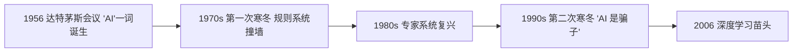
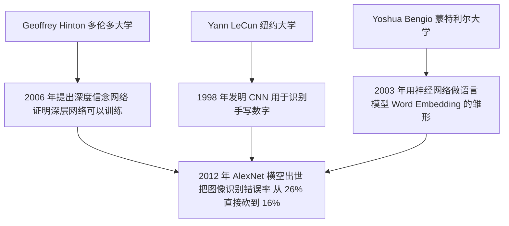
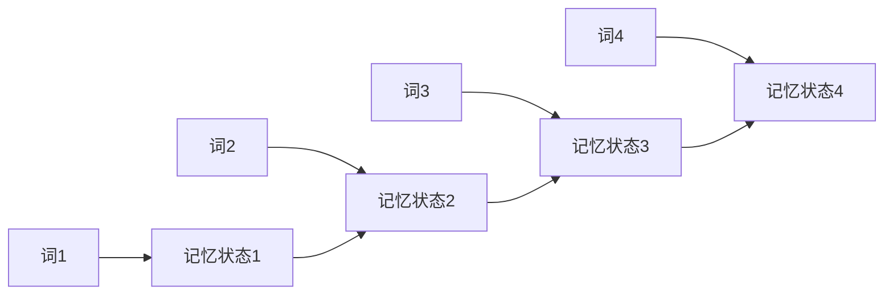
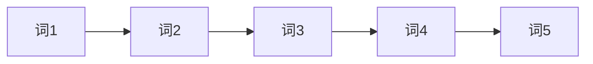
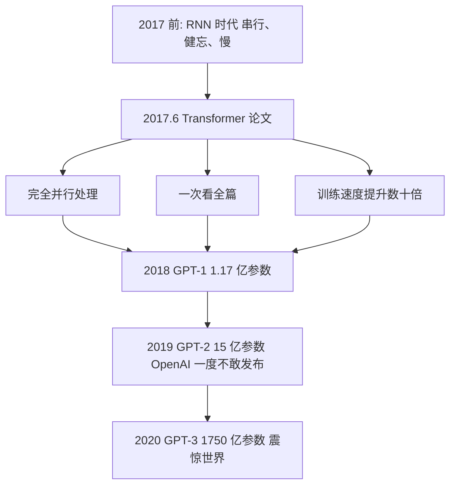
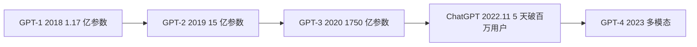
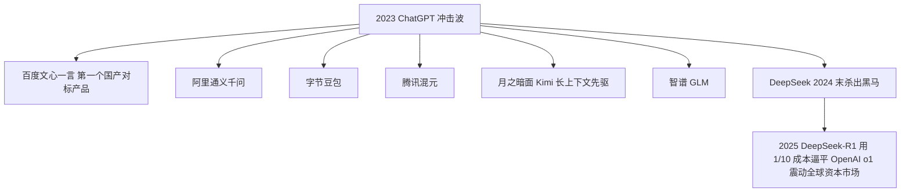
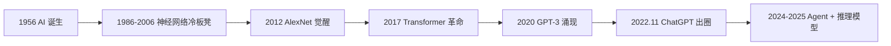

# AI 的前世今生——一部充满故事的编年史

作者：小傅哥
 博客：[https://bugstack.cn](https://bugstack.cn)

> 沉淀、分享、成长，让自己和他人都能有所收获！😄

大家好，我是技术UP主小傅哥。

在拆解 AI 技术之前，先讲讲 AI 是怎么一步步走到今天的。这段历史不仅有意思，而且**每个转折都对应着今天 AI 的一个能力或局限**。读完你会发现：原来 ChatGPT 不是凭空出现的，它身上每一块拼图都有自己的故事。

> 💐 掌握本质，实战项目，积累经验，储备能力。就永远也不会被甩下车！

## 一、史前时代（1950s - 2000s）：AI 的两次"寒冬"

**1956 年夏天，达特茅斯学院**。一群年轻科学家（其中包括后来图灵奖得主 McCarthy、Minsky）开了一个为期两个月的研讨会。会议宣言里第一次出现了 "**Artificial Intelligence**" 这个词。他们当时乐观地认为：**再过 10 年，机器就能像人一样思考。**

结果呢？他们错了——错得很离谱。

接下来 50 年里，AI 经历了两次"寒冬"。每次都是科学家承诺得太多、做不到、政府断了经费、行业崩盘。中间出现过一些有意思的尝试：

- **专家系统**：靠人手工写几万条规则，让计算机模拟医生诊断、律师答疑。结果发现规则越加越多，越来越乱，根本扩展不动。
- **统计 NLP**：放弃规则，改用数学统计。能做翻译，但翻得磕磕巴巴。

> 💡 **关键启示**：人类花了 50 年才明白一件事——**"教"机器是教不会的，得让机器"自己学"**。这就为后来的深度学习埋下了种子。

## 二、深度学习的觉醒（2006 - 2012）：三个"叛逆者"的坚持

整个 90 年代，神经网络是一个**被主流抛弃**的方向。当时学术界普遍认为"神经网络又慢又难训、永远做不出有用的东西"。

但有三个人**就是不信邪**：

**2012 年是 AI 的"创世纪"年份**。Hinton 的学生 Alex Krizhevsky 用 GPU 训练了一个深度神经网络（AlexNet），在 ImageNet 图像识别比赛中把第二名甩开了 10 个百分点。

这一战的意义在于——**所有人突然意识到：GPU + 大数据 + 深层网络，原来真的可以工作！**

那三位"叛逆者"，2018 年共同拿了**图灵奖**（计算机界的诺贝尔奖）。坚持了 30 年的冷板凳，终于热了。

> 💡 **关键启示**：今天所有 AI 的算力基础是 **NVIDIA 的 GPU**。这家公司原本是做游戏显卡的，从来没想过会成为 AI 时代的卖水人。老黄（黄仁勋）现在是世界级首富——而这一切的起点，就是 2012 年 AlexNet 选择用 GPU 训练。

## 三、RNN 的崛起与困境（2013 - 2016）：长文本的"金鱼记忆"

深度学习在图像上爆发后，自然语言处理（NLP）也跟着进入了**深度学习时代**。当时的主角是 **RNN（循环神经网络）** 和它的升级版 **LSTM**。

它们的思路是：处理一句话时，一个词一个词地读，每读一个就更新一下"记忆"。

听起来很合理，对吧？但 RNN 有**两个致命缺陷**：

**缺陷一：金鱼记忆**

句子稍微一长，前面的信息就忘了。比如：

> "小明小时候在云南长大，跟爷爷奶奶一起生活了十几年，吃米线、过泼水节，所以他的母语是____。"

RNN 处理到最后那个空时，前面"云南"的信息几乎已经忘光了，它猜不出"傣语"或"普通话"。

**缺陷二：必须按顺序处理，没法并行**

RNN 必须先读完第 1 个词，才能读第 2 个；读完第 2 个，才能读第 3 个……

这意味着——**你买再多 GPU 也没用**，因为它们只能干等着。RNN 的训练速度被卡死了。

整个 2013-2016 年，NLP 学术界都在拼命改进 RNN，发明了 LSTM、GRU、双向 RNN、注意力机制（早期版本）……**就是治不好这两个病**。

> 💡 **关键启示**：技术的突破往往不是改良，而是**换一种思路**。RNN 走到了死胡同——救它的不是更聪明的 RNN，而是**把 RNN 整个扔掉**的新架构。

## 四、2017 年的"圣经时刻"：Transformer 横空出世

**2017 年 6 月 12 日**，Google 的 8 位研究员（Vaswani、Shazeer、Parmar 等）在 arXiv 上贴了一篇论文:

> **《Attention is All You Need》（你只需要注意力）**

这个标题狂得可以——他们直接说：**之前所有的 RNN、LSTM 都不需要了。只用一个叫"注意力"的机制，就够了。**

这篇论文有几个**戏剧性的小故事**：

- **8 个作者后来全部离开了 Google**。其中 Noam Shazeer 创办了 Character.AI（2024 年 8 月，Google 用约 27 亿美元的授权交易，把他和团队请回 Google 共同领导 Gemini 项目）；Aidan Gomez 创办了 Cohere（估值已超数十亿美元）；Łukasz Kaiser 去了 OpenAI，参与了 GPT-4 与 o1/o3 的核心研发。**"Transformer 八子"几乎组成了硅谷 AI 圈最贵的同学录**。

- **Google 自己反而错过了大模型时代**。它发明了 Transformer，但因为搜索业务太赚钱、又怕新产品冲击老业务，迟迟没有大规模押注。结果让一个名不见经传的小公司——**OpenAI**——抢了先。

- **论文标题来自一首披头士的歌**：《All You Need Is Love》。作者 Llion Jones 后来回忆，取这个名字"花了五秒钟"，他当时根本没想到大家真会用——结果它成了 AI 史上最著名的论文之一。

## 五、OpenAI 的豪赌（2018 - 2022）：把 Transformer 做大

Transformer 出来之后，大部分研究者还在拿它做小规模实验。但**有一家公司决定走极端路线**——这家公司就是 **OpenAI**。

它的思路简单粗暴：

> **Transformer 既然好用，那就把它**做大、做大、再做大。

每一代都有戏剧性的事件：

- **GPT-2（2019）**：OpenAI 训完后**吓得不敢全开源**，担心被用来生成假新闻。这一举动在学术界引起轩然大波，被批评"违背开源精神"。但后来事实证明，他们的担心**完全不是多余**——AI 生成内容的滥用问题在 2023 年后真的全面爆发。这东西我带着大家部署过，像个傻狗。[【部署教程】基于GPT2训练了一个傻狗机器人](https://bugstack.cn/md/algorithm/model/2023-02-12-chat-gpt.html)

- **GPT-3（2020）**：1750 亿参数，训练成本业界估算约 **460 万到 1200 万美元**。当时业内很多人质疑："堆参数有意义吗？" 结果 GPT-3 一发布，能写诗、能编程、能模仿任何人的口吻——所有质疑瞬间消失。

- **ChatGPT（2022.11）**：OpenAI 内部其实只是想"小试一下"，把 GPT-3.5 包了个聊天界面，**没人觉得它会火**。结果上线 5 天破 100 万用户，2 个月破 1 亿——成为人类历史上**用户增长最快的产品**（连 TikTok、Instagram 都没这么快）。微软 CEO 纳德拉看到数据后说了一句话："我们要让 Google 跳舞（dance）。"

> 💡 **关键启示**：很多人以为 ChatGPT 是个"突然出现"的产品。其实它是一条**长达 5 年的押注**：OpenAI 从 2018 年就开始押 Transformer + 大规模 + 自回归这条路。**那些看起来一夜爆红的东西，背后都有人在冷板凳上坐了五年十年**。

## 六、中国 AI 的奋起直追（2023 - 2025）：从跟跑到部分领跑

ChatGPT 火了之后，中国整个科技圈被打了个措手不及。但中国速度起来后，追赶的速度也惊人。

特别值得讲的是 **DeepSeek**：

- 它是一家**杭州的对冲基金（幻方量化）孵化出来的 AI 公司**，没什么明星光环。
- 2024 年 12 月发布 DeepSeek-V3，**V3 的预训练成本约 557 万美元**（基于 2048 张 H800 GPU、约 278 万 GPU 小时），仅为同级别模型的几分之一。
- 2025 年 1 月 20 日发布 DeepSeek-R1（基于 V3 加强化学习训练），**推理能力对标 OpenAI 当时最强的 o1**，**而且完全开源**。
- 这条消息直接引爆全球资本市场：**2025 年 1 月 27 日，NVIDIA 股价单日暴跌约 17%，市值蒸发近 5890 亿美元**——创下美股历史上单只股票单日市值蒸发的新纪录，登上全球财经头条。

中国 AI 从 2023 年的"对标 ChatGPT"，到 2025 年的"在某些方向反过来定义标准"，只用了**两年**。这在科技史上极其罕见。

> 💡 **关键启示**：AI 不是"谁有钱谁赢"的游戏。**算法创新、工程优化、开源共建**，三样东西配齐，小团队也能掀翻巨头。

## 七、把历史浓缩成一句话

**70 年的 AI 史，可以浓缩成一句话**：

> **人类花了 60 年明白"教不会"，花了 5 年学会"让它自己学"，又花了 5 年发现"做大就行"——然后世界就变了。**

理解了这段历史，你就能理解今天 AI 的每一个特点——为什么必须用 GPU、为什么要堆参数、为什么会有幻觉、为什么 OpenAI 一家独大、为什么开源模型现在能反杀。
