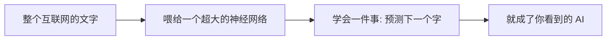
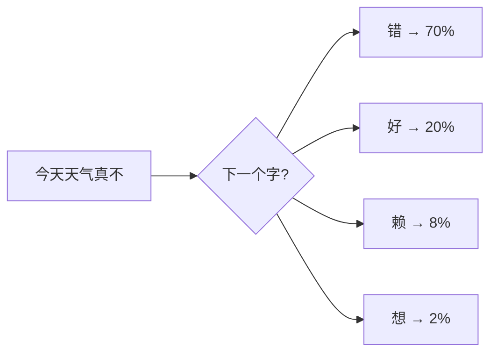
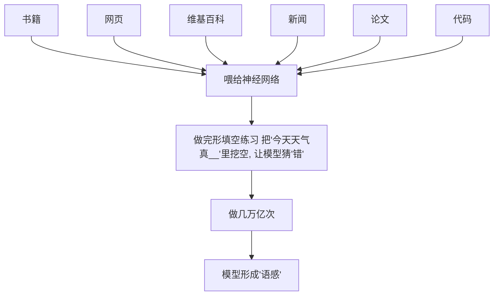

# AI 到底在做什么？——文字接龙的本质

作者：小傅哥
 博客：[https://bugstack.cn](https://bugstack.cn)

> 沉淀、分享、成长，让自己和他人都能有所收获！😄

大家好，我是技术UP主小傅哥。

你以为 AI 像是百度搜索一样的，更准的内容检索吗？但恰恰相反，AI 是一点也不会检索，而是文字接龙，从一个字/词（token）预测下一个字/词（token）。那凭直觉预测（温度），AI 不得是个大傻子？咋那么准呢？

    

**如果一开始就知道，这货就是在组词呢，我也担心准确率！**

单凭随机预判的创作逻辑，听着是不是觉得 AI 笨得离谱？可现实里它既能流畅对话、梳理逻辑，还能写文编程、解答难题，精准度远超大家想象。

这份反差感恰恰是大模型最有意思的奥秘。看似毫无思考逻辑的逐词推演，叠加海量数据沉淀、语义编码、注意力联动层层机制，硬生生拼凑出堪比人脑的智慧表现。接下来咱们抛开晦涩公式，一层层扒开 AI 聪明又时常犯傻的底层真相。

## 一、先建立一个核心比喻

整篇文章我都会围绕一个比喻展开：

> **AI 大模型 = 一个读完了整个互联网，但完全没有人生经历的"超级文字接龙选手"。**

记住这句话。后面所有概念，都是在这个比喻基础上一层层加细节。

## 二、它就是在玩文字接龙

你看到的所有 AI——ChatGPT、豆包、文心一言、Claude、Gemini——它们做的事**只有一件**：

> **看一段话，猜下一个字最可能是什么。**

比如你输入"今天天气真不"，它在脑子里算的是：

然后它选概率最高的"错"，把"今天天气真不错"作为新的输入，再猜下一个字……

**一个字一个字接龙，最后接出一整段话。** 就这么简单。

> 💡 **这里有个反直觉的事实**：AI 没有"想好一段话再说出来"的能力。它是**边接边说**的，连它自己都不知道这句话最后会说成什么样。

## 三、它怎么学会"哪个字概率高"的？

简单一句话：

> **把整个互联网（书、网页、维基、知乎、新闻、论文……）喂给一个超大的神经网络，让它做亿万次"完形填空"练习。**

练了几万亿次之后，它就形成了一种**统计上的语感**——知道在什么上下文下，什么字出现概率最高。

> 这是第一层。听懂了这一层，你已经超过了 80% 的人。

## 四、文字接龙能解释的 AI 现象

理解了"文字接龙"这个本质，你就能解释很多常见的 AI 行为：

### 现象 1：每次问同一个问题，答案都不一样

因为 AI 每次都是从概率分布中**采样**选词，同样的概率分布，采样结果不同。这就是 Temperature 参数在控制——温度越高，采样越随机；温度越低，越倾向于选最高概率的词。

### 现象 2：AI 会"一本正经地胡说八道"

因为接龙的规则是"接出最通顺的话"，而不是"接出最真实的话"。它没有"我不知道"的开关——哪怕不知道，也会接一个看起来像模像样的答案。

### 现象 3：AI 写长文越写越跑题

因为它是"边接边说"，前面接出的偏题句子，会成为后面接龙的上下文，导致越走越远。它不像人类那样有"全局规划"的能力。

---

> 💐 理解 AI 是文字接龙，是理解一切 AI 行为的起点。接下来我们深入 AI 的内部，看看它眼中的"字"长什么样。
