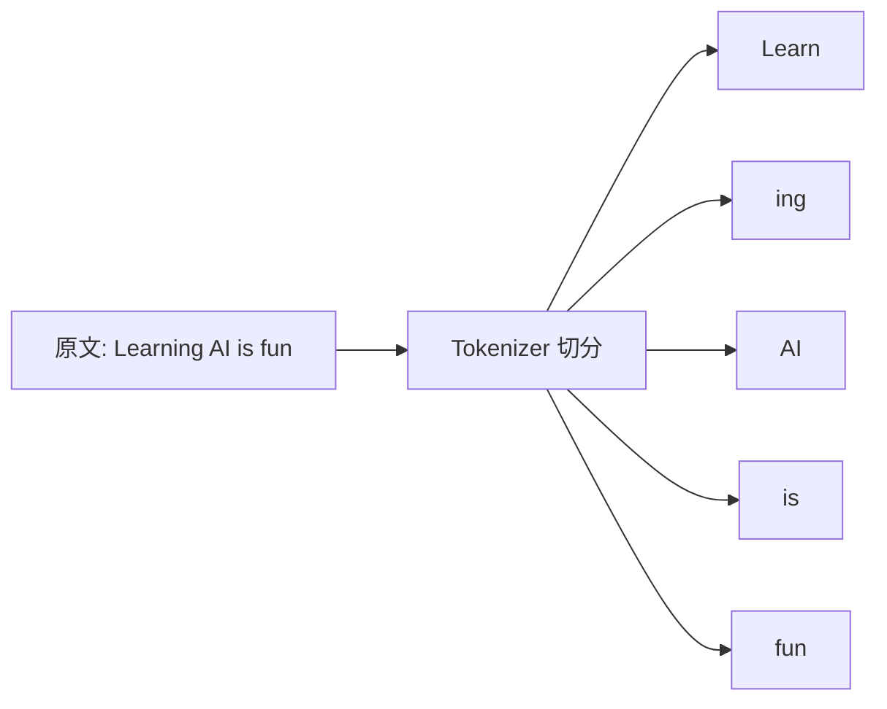
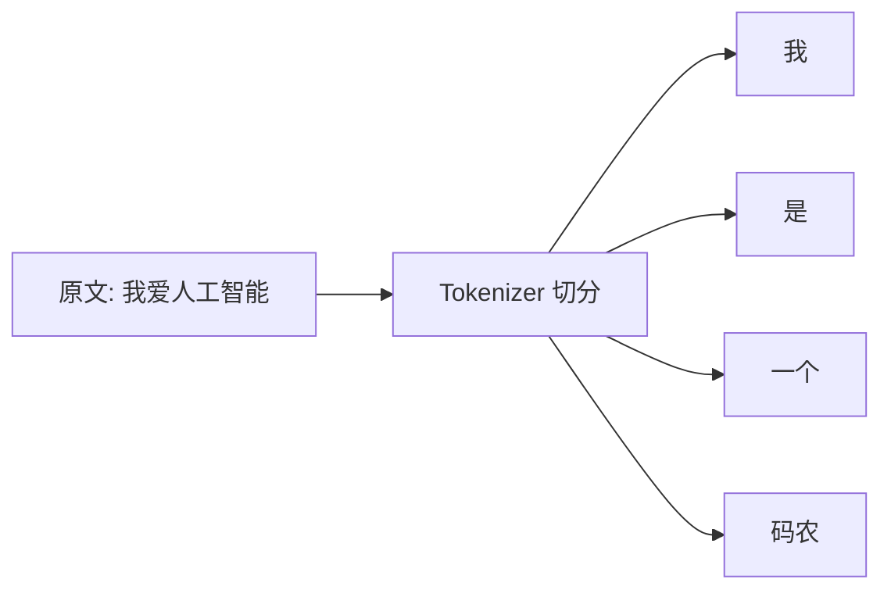
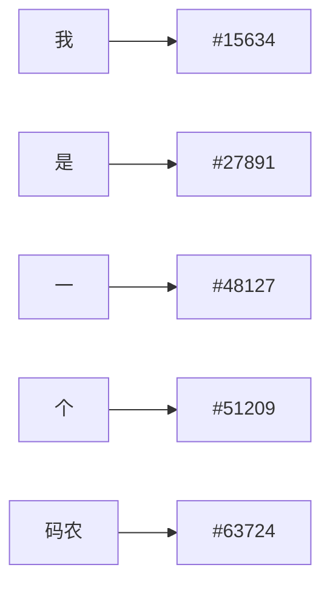
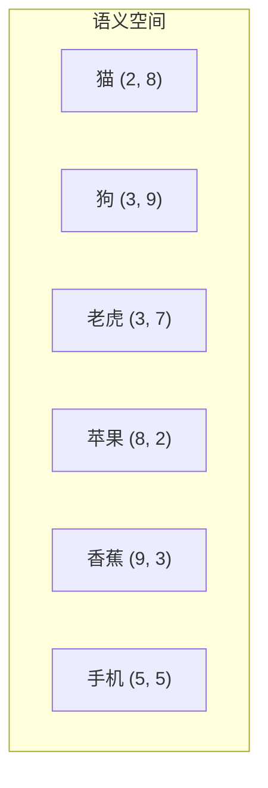
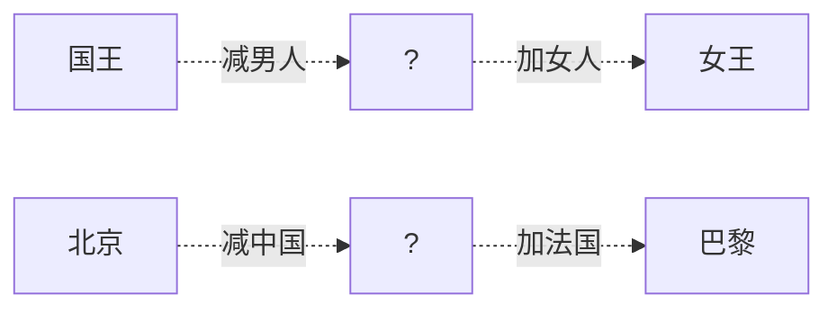
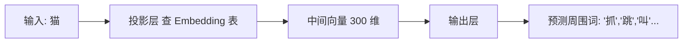

# Token 与 Embedding——AI 眼里的文字世界

作者：小傅哥
<br/>博客：[https://bugstack.cn](https://bugstack.cn)

> 沉淀、分享、成长，让自己和他人都能有所收获！😄

大家好，我是技术UP主小傅哥。

上一篇我们知道了 AI 本质上是"文字接龙"——猜下一个字最可能是什么。但 AI 眼里的"字"跟我们眼中的汉字、英文单词可不一样。这一篇我们就来拆解：**Token（AI 的最小单位）** 和 **Embedding（语义坐标）** —— 这是 AI 处理语言的底层数学，也是当代 AI 工程最基础、最值钱的两个计算。

> 算 Token = 算钱；算 Embedding 距离 = 算意思。

## 一、Token：AI 眼里的"最小单位"

前面说"猜下一个字"，其实不太准确。AI 处理的最小单位不是"字"，叫 **Token**（中文有时翻译成"词元"）。

Token 可以是：

- 一个英文单词（如 `cat`）
- 一个英文单词的片段（如 `Learn` + `ing`）
- 一个汉字（如 `人`）
- 一个汉字组合（如 `人工` + `智能`，看 tokenizer 怎么切）





为什么要这么切？因为这样既能覆盖所有词汇（即使是新词、错别字），又能让模型处理的"词表"控制在几万个的规模，不至于爆炸。

> 💡 **冷知识**：你跟 AI 聊天，按 Token 数收费。中文一个汉字大约 1-2 个 Token，英文一个单词大约 1-1.5 个 Token。所以用中文跟 GPT 聊天比英文贵一点。

## 二、Token 怎么变成数字？

计算机只认数字。所以每个 Token 在 AI 眼里其实是一个**编号**：



好——但只有编号还不够。"15634"和"27891"在数学上看就是两个数字，没有任何含义。

我们需要让计算机知道：**"我"和"你"很相似，"狗"和"猫"很相似，"苹果"和"香蕉"很相似**。

这就引出了下一个核心概念——

## 三、Embedding：把"意思"变成"坐标"

**Embedding** 是 AI 领域最优雅的发明之一。

它的思路是：**给每个词一个高维空间里的坐标**。坐标相近的词，意思就相近。

为了方便理解，我们把"高维空间"简化成二维：



在这个空间里：
- 猫、狗、老虎挤在一起（都是动物）
- 苹果、香蕉挤在一起（都是水果）
- 手机离它们都远（电子产品）

**真实的 Embedding 不是 2 维，而是几百到几千维**。维度越多，能表达的语义关系就越细腻。

### Embedding 最神奇的一点：可以做数学运算

Word2Vec（Google 2013）发现了一个经典现象：

```text
   vec("国王") - vec("男人") + vec("女人") ≈ vec("女王")
   vec("北京") - vec("中国") + vec("法国") ≈ vec("巴黎")
```

**这意味着语义关系被编码成了"方向"**。"性别"是一个方向，"国家-首都"是另一个方向。



> 💡 **这就是为什么 AI 能"理解"语言**：因为它把所有词变成了坐标，理解就变成了坐标之间的加减乘除——计算机最擅长的事。

---

## 四、手把手教你"算"——Token 的演进与实战

### 4.1 第一代：按词切分（Word-level）

最朴素的想法：**遇到空格就切**。

```text
原文：  I love AI
切分：  ["I", "love", "AI"]
Token 数 = 3
```

**问题**：词表会爆炸。英文的"runs / running / ran"会被当成三个完全不同的词；中文更惨——"中国人 / 中国 / 国人"得各占一个位置。最终词表能膨胀到上百万。

### 4.2 第二代：按字符切分（Char-level）

退到极致：**一个字符一个 Token**。

```text
原文：  I love AI
切分：  ["I", " ", "l", "o", "v", "e", " ", "A", "I"]
Token 数 = 9
```

**问题**：词表小了（英文 26 个字母 + 标点就够了），但**序列变得超级长**。一句普通的话拆成几十上百个 Token，模型算起来又慢又笨。

### 4.3 第三代：BPE 子词切分（现代标准）

**BPE（Byte Pair Encoding）**：一种"由数据学出来"的折中方案。

它的思路非常聪明：**让常见的组合保留为一个 Token，少见的拆开**。

举个直观例子，BPE 是这样"训练"出来的：

```text
Step 1: 一开始按字母切
"low low low lowest" → ["l","o","w","l","o","w","l","o","w","l","o","w","e","s","t"]

Step 2: 数哪两个字符相邻出现得最频繁
"l"+"o" 出现了 4 次 → 合并成 "lo"

Step 3: 继续数
"lo"+"w" 出现了 4 次 → 合并成 "low"

Step 4: 继续...
最后形成的词表里就有了 "low" 这个常见单位
而稀有词如 "lowest" 会被切成 "low"+"est"
```

**结果**：常见词整体保留（短而精），罕见词拆成片段（仍能表达）。词表大小被控制在 5 万–10 万之间，覆盖几乎所有可能的输入。

### 4.4 真实 GPT 的切分例子（你可以亲自验证）

下面是一些**真实通过 OpenAI tokenizer 验证过**的 Token 计数（GPT-4 系列使用的 cl100k_base）：

| 原文 | Token 切分（示意） | Token 数 |
|---|---|---|
| `Hello, world!` | `["Hello", ",", " world", "!"]` | 4 |
| `ChatGPT is amazing` | `["Chat", "G", "PT", " is", " amazing"]` | 5 |
| `我爱人工智能` | `["我", "爱", "人工", "智能"]` 或 `["我","爱","人","工","智","能"]` | 4–6 |
| `你好` | `["你","好"]`（每个汉字 1 token，但每个 token 实际占 2-3 字节） | 2 |
| `🚀` | `["🚀"]`（一个 emoji 通常占 2-4 个 byte-level token） | 2–4 |

> 🔧 **想自己验证？** 打开 OpenAI 官方 Tokenizer 页面：[platform.openai.com/tokenizer](https://platform.openai.com/tokenizer)，把任何文本贴进去，它会**实时高亮**告诉你怎么切的、占多少 Token。

### 4.5 一个能用的"心算公式"

工程师常用的近似估算法：

```text
英文：1 token ≈ 0.75 个英文单词 ≈ 4 个英文字符
中文：1 个汉字 ≈ 1.5 ~ 2 个 token
```

**亲自算一下**：

> "今天天气真不错。" — 共 8 个字符（含句号）
> 估算：8 × 1.5 ≈ **12 个 token**（实测 GPT-4：10 个 token，吻合）

> "Hello, my name is GPT-4." — 共 5 个单词 + 标点
> 估算：5 ÷ 0.75 ≈ **7 个 token**（实测：8 个 token，基本吻合）

### 4.6 这能帮你做什么？算钱！

OpenAI GPT-4o 当前价格约（举例）：

```text
输入：$2.50 / 百万 token
输出：$10   / 百万 token
```

**实战**：你写一个客服机器人，每次对话平均：
- 系统 prompt：500 token
- 用户问题：50 token
- AI 回答：300 token

**单次对话成本**：

```text
输入：(500 + 50) tokens × $2.50 / 1,000,000 = $0.001375
输出： 300       tokens × $10   / 1,000,000 = $0.003
合计：≈ $0.0044 / 次对话
```

每天 10000 次对话：**$44/天 ≈ $1320/月**。这就是为什么大型 AI 应用必须精打细算每一个 Token。

---

## 五、Embedding 怎么算？从"坐标"到"相似度"

### 5.1 第一代：One-Hot（独热编码）

最早的做法。假设词表有 5 个词：`[猫, 狗, 苹果, 香蕉, 手机]`。

```text
猫    →  [1, 0, 0, 0, 0]
狗    →  [0, 1, 0, 0, 0]
苹果  →  [0, 0, 1, 0, 0]
香蕉  →  [0, 0, 0, 1, 0]
手机  →  [0, 0, 0, 0, 1]
```

**致命问题**：任意两个词的距离都一样（都是 √2），完全没有语义信息。

### 5.2 第二代：共现矩阵（Co-occurrence）

观察："猫"和"狗"经常出现在同一句话里，"猫"和"手机"很少。所以**统计两个词在同一窗口内出现的次数**。

```text
词表：猫 / 狗 / 苹果 / 香蕉 / 手机

共现矩阵（简化）：
        猫  狗  苹果 香蕉 手机
   猫  [ 0,  8,  1,  1,  0 ]
   狗  [ 8,  0,  1,  1,  0 ]
   苹果[ 1,  1,  0,  9,  0 ]
   香蕉[ 1,  1,  9,  0,  0 ]
   手机[ 0,  0,  0,  0,  0 ]
```

**每一行**就是这个词的初代 "Embedding"！你已经能看出来：
- 猫 [0,8,1,1,0] 和 狗 [8,0,1,1,0] 非常像 → 它们语义相近
- 苹果 [1,1,0,9,0] 和 香蕉 [1,1,9,0,0] 非常像 → 它们语义相近

**问题**：维度等于词表大小，太大太稀疏。

### 5.3 第三代：Word2Vec（2013 Google）—— 划时代

把共现矩阵**压缩**到几百维稠密向量。原理简化到极致就是：

> **训练一个小神经网络去做"猜词"游戏：根据中心词猜上下文词。猜对了就调整权重。训练完成后，神经网络中间层的权重，就是每个词的 Embedding。**



### 5.4 用真实 Embedding 算一次"语义距离"

为了让你看见数字，我们用一个**简化到 4 维**的演示（真实是 300/768/1536 维）：

```text
猫     ≈ [ 0.91,  0.85,  0.10, -0.08]
狗     ≈ [ 0.88,  0.83,  0.12, -0.06]
老虎   ≈ [ 0.82,  0.79,  0.05, -0.10]
苹果   ≈ [ 0.05, -0.12,  0.90,  0.86]
香蕉   ≈ [ 0.08, -0.10,  0.88,  0.91]
手机   ≈ [-0.30, -0.25, -0.40, -0.35]
```

衡量"语义相似度"最常用的是 **余弦相似度（Cosine Similarity）**——也就是衡量两个向量"指向是否接近"。

### 5.5 余弦相似度公式（不要怕，跟着算一遍）

公式：

```text
cosine(A, B) = (A·B) / (|A| × |B|)

其中：
   A·B = a1×b1 + a2×b2 + ... + an×bn   （点积）
  |A|  = √(a1² + a2² + ... + an²)       （向量长度）
```

**手算示例**：算"猫"和"狗"的相似度

```text
A = 猫 = [0.91, 0.85, 0.10, -0.08]
B = 狗 = [0.88, 0.83, 0.12, -0.06]

Step 1: 算点积 A·B
A·B = 0.91×0.88 + 0.85×0.83 + 0.10×0.12 + (-0.08)×(-0.06)
    = 0.8008 + 0.7055 + 0.012 + 0.0048
    = 1.5231

Step 2: 算 A 的长度
|A| = √(0.91² + 0.85² + 0.10² + 0.08²)
    = √(0.8281 + 0.7225 + 0.01 + 0.0064)
    = √1.567
    ≈ 1.2518

Step 3: 算 B 的长度
|B| = √(0.88² + 0.83² + 0.12² + 0.06²)
    = √(0.7744 + 0.6889 + 0.0144 + 0.0036)
    = √1.4813
    ≈ 1.2171

Step 4: 算余弦相似度
cosine(猫, 狗) = 1.5231 / (1.2518 × 1.2171)
              = 1.5231 / 1.5236
              ≈ 0.9997
```

**结论**：猫和狗的相似度 ≈ **0.9997**（满分 1.0），非常相近。

### 5.6 再算"猫"和"手机"对比一下

```text
A = 猫   = [ 0.91,  0.85,  0.10, -0.08]
B = 手机 = [-0.30, -0.25, -0.40, -0.35]

A·B = 0.91×(-0.30) + 0.85×(-0.25) + 0.10×(-0.40) + (-0.08)×(-0.35)
    = -0.273 + (-0.2125) + (-0.04) + 0.028
    = -0.4975

|B| = √(0.09 + 0.0625 + 0.16 + 0.1225) = √0.435 ≈ 0.6595

cosine(猫, 手机) = -0.4975 / (1.2518 × 0.6595)
                = -0.4975 / 0.8255
                ≈ -0.6027
```

**结论**：猫和手机的相似度 ≈ **-0.60**（负数意味着语义相反方向）。

### 5.7 一张表看清楚

| 词对 | 余弦相似度 | 解读 |
|---|---|---|
| 猫 vs 狗 | ≈ 0.9997 | 同类、几乎重合 |
| 猫 vs 老虎 | ≈ 0.997 | 同类、强相关 |
| 苹果 vs 香蕉 | ≈ 0.998 | 同类水果 |
| 猫 vs 苹果 | ≈ 0 | 几乎正交（不相关） |
| 猫 vs 手机 | ≈ -0.60 | 强烈不相关 |

**这就是 RAG（检索增强）的数学基础**：把你的问题变成一个向量，把知识库每段文字变成向量，然后用余弦相似度找最相近的那几段——给 AI 当"参考资料"。

### 5.8 验证经典的"国王 - 男人 + 女人 ≈ 女王"

假设我们有这些向量（演示用，4 维简化）：

```text
国王 = [0.95, 0.20, 0.85, 0.10]
男人 = [0.30, 0.10, 0.80, 0.05]
女人 = [0.30, 0.90, 0.80, 0.05]
女王 = [0.95, 0.95, 0.85, 0.10]
```

**算"国王 - 男人 + 女人"**：

```text
[0.95, 0.20, 0.85, 0.10]
- [0.30, 0.10, 0.80, 0.05]
= [0.65, 0.10, 0.05, 0.05]

[0.65, 0.10, 0.05, 0.05]
+ [0.30, 0.90, 0.80, 0.05]
= [0.95, 1.00, 0.85, 0.10]
```

把结果 `[0.95, 1.00, 0.85, 0.10]` 跟"女王" `[0.95, 0.95, 0.85, 0.10]` 比一比——几乎完全一致！

> 💡 **这就是 Word2Vec 当年震惊学术界的原因**：语义居然真的能像三维空间里的几何向量一样进行加减运算。

### 5.9 真实场景中 Embedding 怎么用？

你完全可以自己上手：

```text
1. OpenAI 提供 text-embedding-3-small 模型
   输入文本 → 输出 1536 维向量

2. 调用一次大约 1024 token 的成本：≈ $0.00002

3. 把你的所有文档都跑一遍 → 存进向量数据库（Pinecone/Milvus/Chroma）

4. 用户提问时:
   - 把问题转成 1536 维向量
   - 在数据库里找余弦相似度最高的 Top-5 段落
   - 把这 5 段 + 用户问题打包发给 GPT-4
   - GPT-4 基于这些"开卷资料"回答
```

**这就是企业 AI 助手的标准做法**。看完这一节，你已经知道它的底层在算什么了。

---

## 六、一句话总结

> Token 是 AI 的"字"，Embedding 是 AI 的"语义坐标"。
>
> **算 Token = 算钱**；**算 Embedding 距离 = 算意思**。
>
> 这两件事是当代 AI 工程最基础、最值钱的两个计算。
