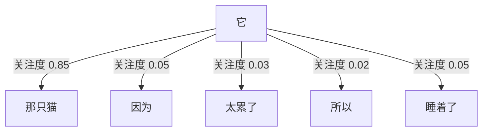
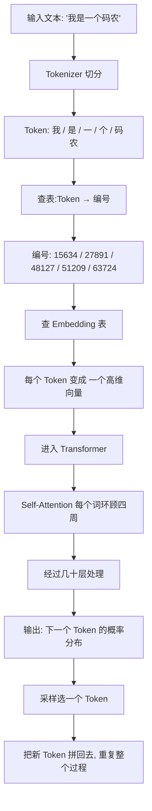

# 注意力机制——AI 怎么"看懂"一整句话

作者：小傅哥
 博客：[https://bugstack.cn](https://bugstack.cn)

> 沉淀、分享、成长，让自己和他人都能有所收获！😄

大家好，我是技术UP主小傅哥。

前面我们知道了 AI 把文字变成 Token 和 Embedding 坐标。但光有坐标还不够——"小狗咬小孩"和"小孩咬小狗"用了一模一样的词，意思却完全相反。模型必须知道**词和词之间的关系**。这就是 **注意力机制（Attention）** 的价值。

## 一、一个问题：词序很重要

"小狗咬小孩"和"小孩咬小狗"用了一模一样的词，但意思完全相反。

光有 Embedding 不够，模型必须知道**词和词之间的关系**。

## 二、注意力机制：让每个词"环顾四周"

2017 年 Google 提出了 **Transformer 架构**，里面最核心的发明叫 **Self-Attention（自注意力）**。

它的思路用大白话说就是：

> **每个词在被理解的时候，都要回头看一下句子里的其他词，给每个词分配一个"关注度"。**

比如这句话："**那只猫**因为太累了，所以它睡着了。"

模型在处理"它"这个词时，会做什么？

"它"这个词，把 85% 的注意力都放到了"那只猫"上——所以模型知道："它"指的是"那只猫"。

**这就是 AI 能"看懂"语言指代、上下文、长距离关系的原因。**

> 📖 **幕后故事：注意力机制是怎么"反客为主"的**
>
> 注意力机制最早不是为了取代 RNN 而生的，它本来只是 RNN 的一个**辅助插件**——2014 年 Bengio 团队为了让翻译模型记住更长的句子而发明。
>
> 当时大家把它当成"调味料"：往 RNN 里加一勺，效果更好。
>
> 直到 2017 年那 8 个 Google 研究员做了一件事——他们想："**既然注意力这么好用，那干脆把 RNN 全删了，只留注意力呢？**"
>
> 当时连他们自己都没把握。结果一上线，**所有人都傻眼了**：不仅效果好，速度还快了几十倍。
>
> 这就是 AI 史上著名的"调味料反客为主"事件。**很多颠覆性的创新，都不是设计出来的，是"试出来的"**。

## 三、整张图：一段话进入模型后发生了什么

把前面学的 Token、Embedding、Attention 串起来，看一段文本是怎么流过 AI 大脑的：

> 💡 这就是 GPT 系列、Claude、Gemini、文心、通义、DeepSeek……**所有现代大模型的统一架构**。

## 四、注意力机制能解释的 AI 行为

### 为什么 AI 能理解长距离指代？

因为 Self-Attention 让每个词都能"直接看到"句子中任意位置的其他词——不需要像 RNN 那样一步步传递。所以"它"可以直接"关注到"很远处的"那只猫"。

### 为什么长文越往后注意力越"散"？

虽然理论上每个词都能看到所有其他词，但**注意力预算是有限的**。上下文越长，每个词分到的"注意力"就越少。这就是所谓的 "Lost in the Middle" 现象——长文档中间的信息最容易被忽略。

### 为什么 Transformer 比 RNN 快几十倍？

因为 Self-Attention 可以**完全并行**计算——所有词的注意力可以同时算，不需要像 RNN 那样一个接一个串行处理。这就是为什么 Transformer 能充分利用 GPU 的并行能力。

