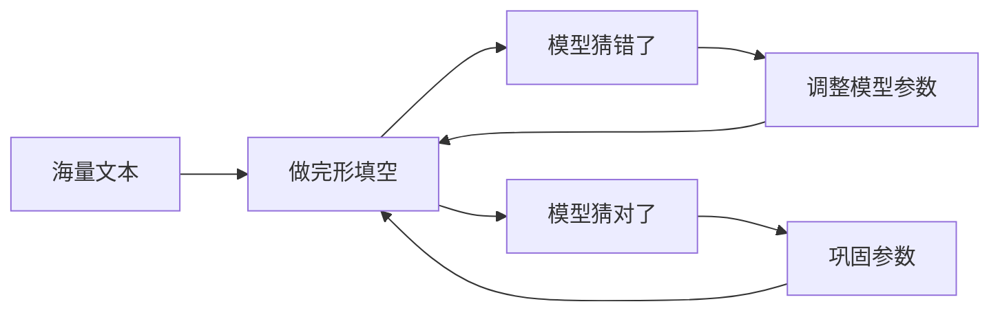
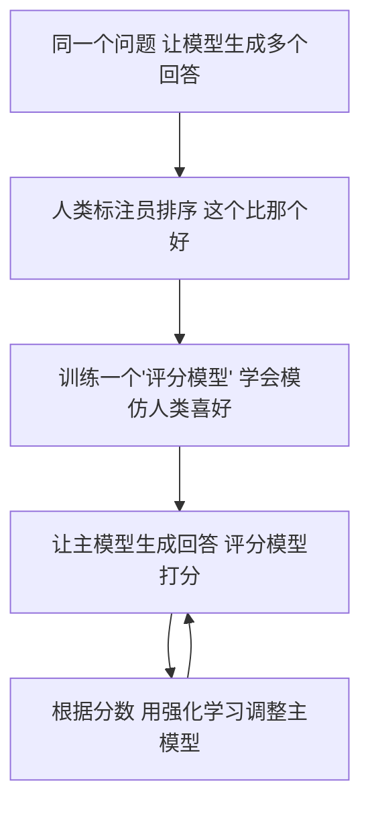

# 模型训练三步曲——预训练、微调、对齐

作者：小傅哥
 博客：[https://bugstack.cn](https://bugstack.cn)

> 沉淀、分享、成长，让自己和他人都能有所收获！😄

大家好，我是技术UP主小傅哥。

前面我们讲了 AI 的本质是文字接龙，讲了 Token 和 Embedding，讲了注意力机制。但这些都是**模型已经训练好之后**怎么用。那它最开始是怎么学会的？现代大模型的训练分**三步**，缺一不可。

## 一、第一步：预训练（Pre-training）—— 让 AI "读完整个互联网"

- **目标**：学会语言规律和世界知识
- **数据**：几十 TB 的网页、书籍、代码
- **方法**：不停做完形填空
- **代价**：需要几千张顶级 GPU、训练几个月、烧掉几千万到几亿美元

这一步完成后，模型已经知识渊博，但**不太会聊天**——你问一句它可能给你接龙一段维基百科。

## 二、第二步：监督微调（SFT）—— 教 AI "怎么好好说话"

- **目标**：让模型学会"对话格式"和"指令遵循"
- **数据**：几万到几十万条人工精心编写的"问-答"对
- **方法**：让模型模仿优秀回答

这一步之后，模型会聊天了，但还会出现各种**不太合适**的回答——比如说脏话、给危险建议、答非所问。

## 三、第三步：RLHF —— 让 AI "懂人话、合人意"

RLHF = **基于人类反馈的强化学习**。这是 ChatGPT 真正惊艳世人的秘密武器。

- **目标**：让模型回答**符合人类偏好**——有用、诚实、无害
- **数据**：人类对模型回答的偏好排序
- **方法**：强化学习

> 💡 **这里有个有趣的副作用**：RLHF 后的模型，会变得"过度自信"和"过度礼貌"。因为人类标注员喜欢自信、礼貌的回答。所以现代 AI 模型反而更容易**装作自己什么都知道**——这就是幻觉的一个根源。

> 📖 **幕后故事：ChatGPT 那 5 万小时的"血汗"**
>
> RLHF 听起来很高大上，但它其实极其依赖**人**。
>
> 训练 ChatGPT 时，OpenAI 雇了大量的标注员（很多是肯尼亚的外包公司），给模型生成的成千上万条回答**做排序**："这条比那条好"、"这条有害"、"这条更礼貌"……
>
> 据 *Time* 杂志报道，肯尼亚的标注员时薪不到 2 美元，每天要看大量包含暴力、色情、仇恨内容的文本，**心理负担巨大**。这是 ChatGPT 光鲜表面下不为人知的一面。
>
> 这件事也说明了一个事实：**AI 不是凭空"学聪明"的，它的每一点"懂事"，背后都是大量人类的劳动**。下次你跟 ChatGPT 聊天觉得它特别贴心时，可以记住——那贴心是几千个人手把手"调教"出来的。

## 四、训练全景图

## 五、训练三步曲能解释的 AI 行为

### 为什么 AI 的知识有截止日期？

因为预训练数据是有时间范围的。模型一旦训练完成就"冻结"了，不会自己上网更新。所以问它今天的新闻、股价，它给的可能是过时的信息——甚至可能编造一个"看起来合理"的答案。

### 为什么 AI 有时候过度礼貌？

RLHF 的训练过程让模型学会了"人类喜欢礼貌的回答"。所以它会过度道歉、过度感谢，甚至在你不需要客气的时候也客客气气的。

### 为什么 AI 会"过度自信"？

同样是因为 RLHF——人类标注员倾向于给"自信的"回答打高分，即使答案是错的。所以模型学会了"用确定的语气说话"，而不是说"我不确定"。