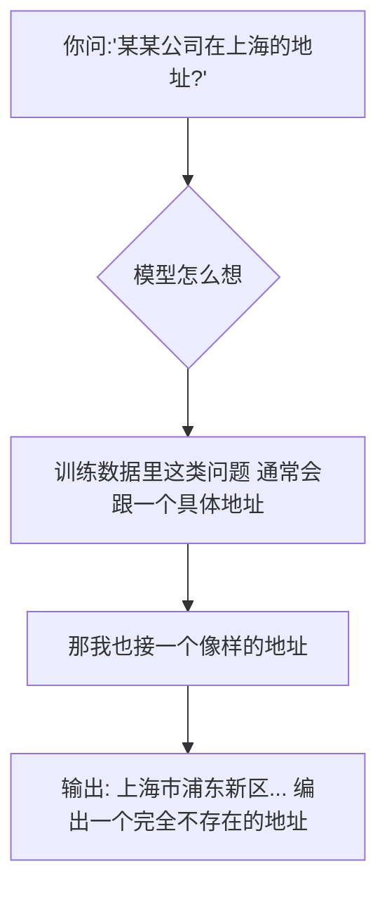
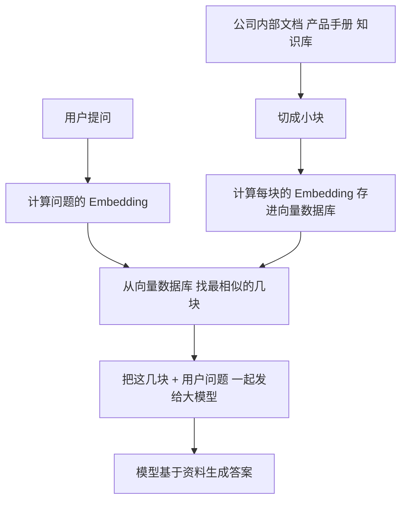

# 幻觉——为什么 AI 会"胡说八道"？

作者：小傅哥
 博客：[https://bugstack.cn](https://bugstack.cn)

> 沉淀、分享、成长，让自己和他人都能有所收获！😄

大家好，我是技术UP主小傅哥。

终于到了大家最关心的问题：为什么 AI 会"胡说八道"？明明看起来那么聪明的 AI，为什么有时候会编造完全不存在的事实？这不是 Bug，而是机制决定的。

## 一、幻觉不是 Bug，是机制决定的

回到我们最开始的核心比喻：**AI 是文字接龙选手**。

它的工作原理是"必须接出下一个字"。它**没有**：

- ❌ "我不知道"的开关
- ❌ 一个事实数据库可以查
- ❌ 区分"真"和"假"的能力

它只有一个**概率分布**。

它不是"故意撒谎"——**它根本不知道什么叫"撒谎"**。

它只是在做它最擅长的事：**让接出来的话看起来通顺、合理、像那么回事**。

## 二、幻觉的数学必然性

2024 年 OpenAI 自己发了一篇论文 *Why Language Models Hallucinate*，证明了一件事：

> **在标准的训练和评测体系下，"猜一个"比"承认不知道"得分更高。所以模型会被训练成"宁可瞎编也不空着"。**

这意味着幻觉**不能靠堆参数消除**，必须靠**外部系统**解决。

## 三、工程上怎么对付幻觉？

业界的标准做法叫 **RAG（检索增强生成）**：

打个比方：

- **没 RAG** = 让学生闭卷考试 → 容易瞎编
- **用 RAG** = 让学生开卷考试 → 答案有根有据

> 💡 **这就是为什么"企业内部 AI 助手"基本都是 RAG 架构**：你不能让通用 AI 知道你公司内部的事，但你可以"开卷"让它现场查。

## 四、幻觉的常见场景与应对

| 场景 | 幻觉表现 | 应对方法 |
|---|---|---|
| 问具体数字/地址 | 编造一个看起来合理的 | 要求"原文引用"，或用 RAG |
| 问实时信息 | 给出过时的数据 | 开联网模式，让 AI 搜索 |
| 问专业领域知识 | 编造不存在的概念 | 用专业领域 RAG 知识库 |
| 让 AI 算数学题 | 给出"看起来对但实际错"的数字 | 让 AI 列步骤，或用工具 |

## 五、对幻觉的正确态度

不要期望 AI "不再有幻觉"——这是文字接龙机制的固有特性。正确的态度是：

1. **永远核实关键信息**：涉及钱、法律、医疗、安全的内容，一定要人工确认
2. **用 RAG 架构**：让 AI 基于你的真实数据回答，而不是凭空编造
3. **要求 AI 标注来源**：让 AI 说出"我根据什么得出了这个结论"
4. **用工具代替猜测**：数学用计算器，实时数据用搜索，不要让 AI "猜"

> 💡 幻觉不是 AI 的缺陷，而是它的本质特性。理解了这一点，你就不会再被 AI "一本正经的胡说八道"所迷惑了。
