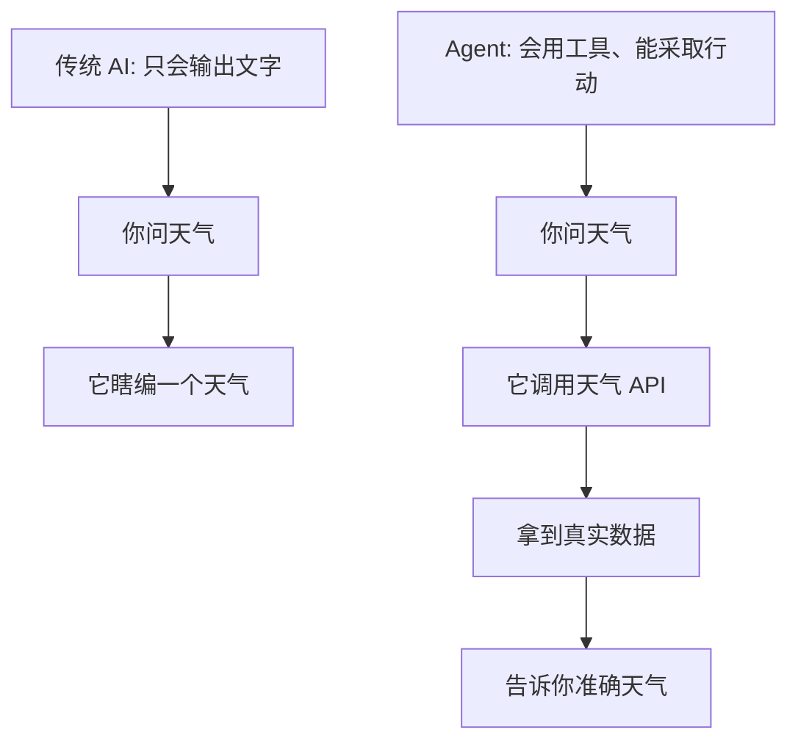
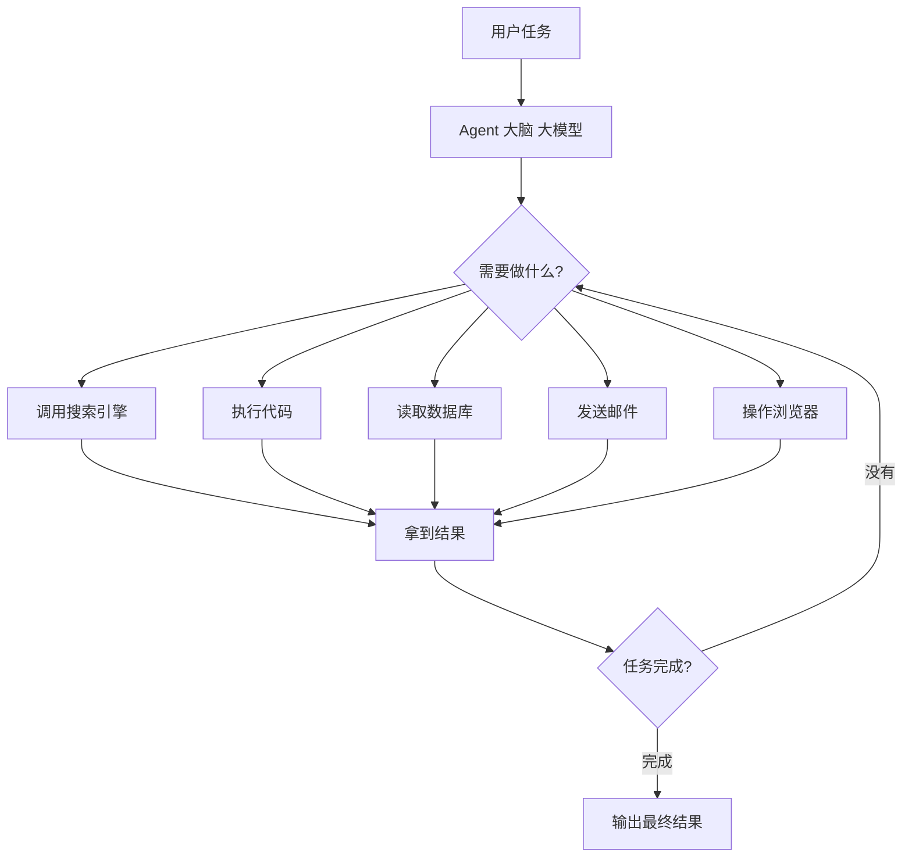
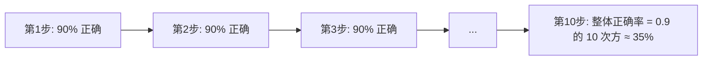

# Agent 时代——AI 不只是聊天

作者：小傅哥
 博客：[https://bugstack.cn](https://bugstack.cn)

> 沉淀、分享、成长，让自己和他人都能有所收获！😄

大家好，我是技术UP主小傅哥。

到目前为止，我们讲的 AI 都只能"输出文字"。但 2024 年开始，业界进入了 **Agent（智能体）** 时代。什么是 Agent？一句话：**会用工具、能完成任务的 AI。**

## 一、从"会说"到"会做"

## 二、Agent 的核心组件

简单说，Agent = **大模型 + 工具集 + 一个循环**：

1. 看任务
2. 想想要不要用工具，用哪个
3. 用工具，拿到结果
4. 想想下一步
5. 循环，直到任务完成

## 三、真实世界的 Agent 例子

- **Cursor / Claude Code / WaLiCode**：你说"帮我把这个功能改成异步的"，它自己读代码、改代码、跑测试。
- **Devin**：号称"AI 软件工程师"，能从一个 GitHub Issue 开始，自己分析、修代码、提 PR。
- **企业客服 Agent**：用户问问题，它查订单、查物流、查退款政策、给出处理方案。

## 四、Agent 的现状：很美好，但很难

实话说，Agent 目前还远没到"完全替代人"的地步。原因：

**每一步都可能出错，错误会累积**。所以现在所有靠谱的 Agent 都不是"完全自主"，而是：

> **把工作流程画成一张图，AI 在图上"沿着轨道走"，关键节点由 AI 决策，但整体框架由人定。**

这叫 **Workflow + LLM**，是目前最务实的工业级 Agent 模式。

## 五、幕后故事：Devin 的"过山车"与 DeepSeek-R1 的"低成本奇迹"

**Devin 的故事**：2024 年 3 月，Cognition Labs 发布了 Devin，宣称是"世界上第一个 AI 软件工程师"。演示视频里它从看 Issue、读代码、写代码、跑测试、提 PR 一气呵成，**整个硅谷都疯了**。公司估值一夜从 0 飙到 20 亿美元。

但几个月后，AI 评测博主 *Internet of Bugs* 发了一条扒皮视频，逐帧分析 Devin 的演示——**发现里面有大量精心剪辑、跳过失败、反复重试**。真实使用率远低于演示。

这给整个行业泼了一盆冷水，让大家清醒过来：**Agent 离"完全自主"还很远，目前最务实的方向是"AI 加速人，而不是替代人"**。Cursor、Claude Code 这种"AI 提议、人确认"的模式，反而活得最滋润。

**DeepSeek-R1 的故事**：2025 年 1 月 20 日，杭州一家叫 DeepSeek 的小公司发布了 R1 模型——**推理能力对标 OpenAI 当时最贵的 o1，而背后的基础模型 V3 训练成本约 557 万美元**（OpenAI 同级模型据估算花了上亿美元）。更狠的是：**完全开源、技术报告全公开**。

这一事件直接引发了**全球资本市场地震**：2025 年 1 月 27 日，NVIDIA 股价单日暴跌约 17%、市值蒸发近 5890 亿美元，刷新美股单日单股市值蒸发纪录。原因很简单——如果顶级 AI 能用 1/20 的成本做出来，那"无脑买卡"的逻辑就动摇了。

R1 还有一个更重要的技术贡献：它证明了**仅靠强化学习（R1-Zero 阶段），不经过 SFT，模型就能自发学会推理、反思、自我纠错**。这是大模型领域近三年最重要的发现之一。

这两个故事合在一起说明一件事——**AI 行业现在的速度，是按"周"在变化的**。今天的明星，下个月可能就被反超；今天看似遥不可及的能力，明年可能开源到你能在自己电脑上跑。**保持学习、不要押宝任何单一技术**，是这个时代的生存之道。
