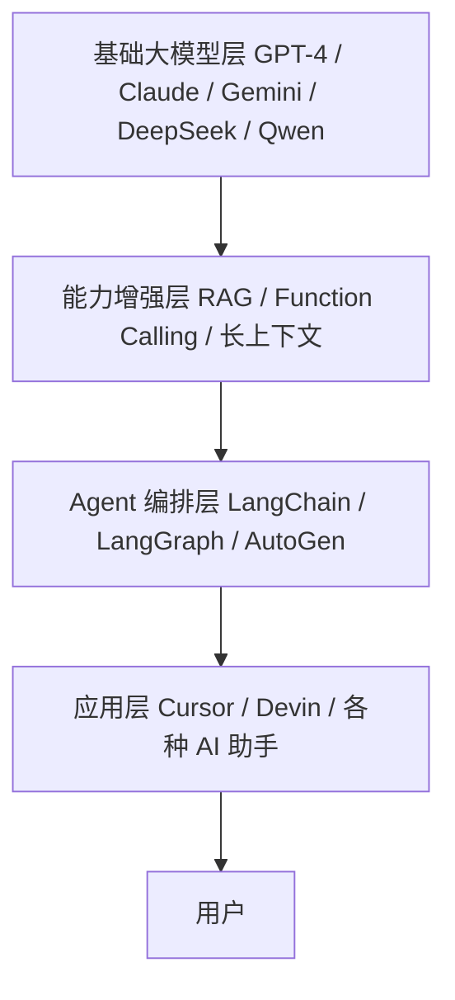

# 未来展望——AI 会变成什么样？

作者：小傅哥
 博客：[https://bugstack.cn](https://bugstack.cn)

> 沉淀、分享、成长，让自己和他人都能有所收获！😄

大家好，我是技术UP主小傅哥。

了解了 AI 的历史、本质、技术细节之后，大家最关心的当然是：未来会怎样？这一篇我们来聊聊未来三年 AI 的发展方向。

## 一、AI 工业栈全景图

整个 AI 工业栈大概长这样：

## 二、未来三年值得关注的几条线

### 1. 推理时计算（Test-Time Compute）

让模型"想得更久 = 答得更准"。OpenAI o1/o3、DeepSeek-R1 已经验证了这条路。

传统的 AI 推理是"想一下就回答"，而推理时计算让模型可以"想很久再回答"——在内部生成多条思路链，验证、筛选、反思，最后给出最优答案。

这就像考试时，一道难题你花 10 秒凭直觉写 vs 花 5 分钟认真推导——答案质量天差地别。

### 2. 多模态

从只懂文字，到能看图、听音、操作屏幕、控制机器人。

- **视觉**：理解图片、视频内容，能"看"你发的截图
- **语音**：实时对话，理解语气和情感
- **操作**：控制电脑、操作手机、驾驶汽车
- **机器人**：物理世界的 AI Agent

### 3. 长期记忆

让 AI 记住你是谁、跟你聊过什么，跨会话保留。

现在的 AI 每次新对话都是"白纸一张"。未来的 AI 会拥有：
- **工作记忆**：当前对话的上下文
- **短期记忆**：最近几次对话的摘要
- **长期记忆**：你的偏好、习惯、历史交互

### 4. AI 原生应用

不是给老软件加 AI，而是从头设计的 AI-first 产品。

传统思路是"在现有产品上加一个 AI 按钮"，AI 原生思路是"围绕 AI 的能力重新设计整个交互流程"。就像 iPhone 不是"在手机上加触摸屏"，而是"围绕触摸屏重新定义手机"。

## 三、几个可能的终局形态

### 形态一：AI 操作系统

AI 成为所有软件的统一入口。你不再打开 Word、Excel、邮件客户端，而是跟 AI 说"帮我写一封邮件"、"分析这个表格"——AI 自动调用相应工具完成。

### 形态二：个人 AI 助理

每个人都有一个专属 AI，它了解你的习惯、帮你安排日程、处理邮件、做研究、写报告。这可能是 AI 最具变革性的应用。

### 形态三：AI 与人类协作

AI 不替代人，而是成为人的"外脑"。人类负责方向和判断，AI 负责执行和优化。这可能是最务实的短期方向。

## 四、需要警惕的风险

- **幻觉问题不会消失**：这是文字接龙机制的固有特性
- **隐私和安全**：AI 记住你的一切，也意味着数据风险
- **就业冲击**：重复性工作会被 AI 替代，但创造性工作会被 AI 增强
- **技术依赖**：过度依赖 AI 可能导致人类能力退化

> 💡 **理解 AI 是这个时代的复利能力。早一点搞明白，未来几年的红利就早一点吃到。**

