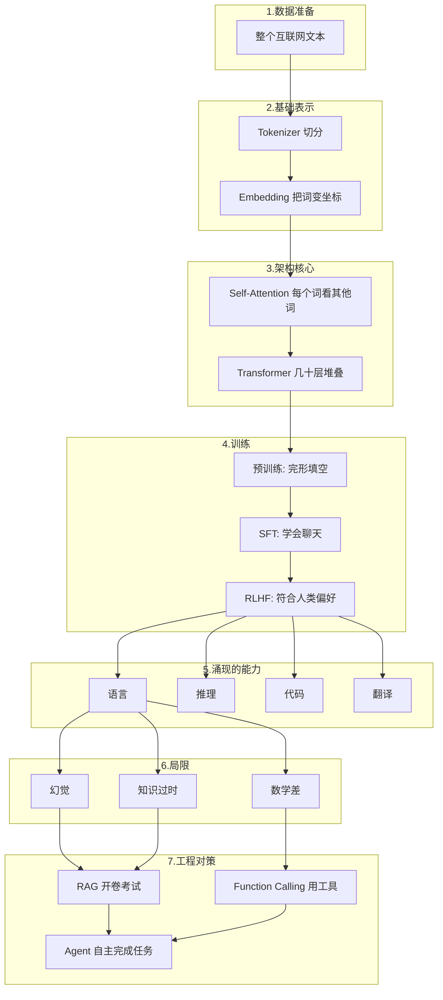

# 概念速查表——AI 核心概念一图尽览

作者：小傅哥
 博客：[https://bugstack.cn](https://bugstack.cn)

> 沉淀、分享、成长，让自己和他人都能有所收获！😄

大家好，我是技术UP主小傅哥。

这是 AI LLM 系列文章的概念速查表和知识串联篇。把前面所有文章讲的概念串成一个完整的故事，一张表存下来，下次看到这些词，你就不会再发怵了。

## 一、把整个故事串起来

## 二、核心概念速查表

| 概念 | 一句话解释 | 详细文章 |
|---|---|---|
| **Token** | AI 眼里的最小单位，像字也像词 | [Token 与 Embedding](ai-llm-03-token-embedding.md) |
| **Embedding** | 把词变成多维空间里的坐标，坐标近 = 意思近 | [Token 与 Embedding](ai-llm-03-token-embedding.md) |
| **Self-Attention** | 每个词去"环顾"句子里的其他词，理解关系 | [注意力机制](ai-llm-04-attention.md) |
| **Transformer** | 把 Attention 堆叠几十层形成的大脑结构 | [注意力机制](ai-llm-04-attention.md) |
| **预训练** | 喂海量文本做完形填空，让模型学到语言和知识 | [模型训练三步曲](ai-llm-05-training.md) |
| **SFT** | 用高质量对话样本，教模型怎么聊天 | [模型训练三步曲](ai-llm-05-training.md) |
| **RLHF** | 用人类偏好反馈，让模型变得更"懂人" | [模型训练三步曲](ai-llm-05-training.md) |
| **涌现** | 模型大到某个临界点，新能力突然出现 | [涌现](ai-llm-06-emergence.md) |
| **幻觉** | AI 编造看似合理但实际错误的内容 | [幻觉](ai-llm-07-hallucination.md) |
| **RAG** | 检索增强生成 = 让 AI 开卷考试 | [幻觉](ai-llm-07-hallucination.md) |
| **Function Calling** | 让 AI 会调用外部工具 | [Agent 时代](ai-llm-08-agent.md) |
| **Agent** | 会用工具、能完成任务的 AI | [Agent 时代](ai-llm-08-agent.md) |

## 三、理解程度自测

读完这个系列的文章，根据你的理解程度，可以分成三档：

| 档位 | 你应该能说出 |
|---|---|
| **入门** | AI 是文字接龙，会胡说，得自己核对 |
| **进阶** | AI 把词变成坐标，靠注意力理解上下文，靠预训练+SFT+RLHF 三步学习 |
| **熟手** | 我知道大模型 + RAG + Agent + MCP（后续分享） + Skills（后续分享） 怎么组合，能跟工程师讨论方案 |

如果你看完只到了"入门"档，也没关系——把整个系列收藏，过一周再读一遍，你会发现很多之前没注意的细节变清晰了。

## 四、系列文章目录

| 序号 | 文章 | 核心内容 |
|---|---|---|
| 1 | [AI 的前世今生](ai-llm-01-history.md) | 从 1956 到 2025，70 年 AI 编年史 |
| 2 | [文字接龙的本质](ai-llm-02-word-continuation.md) | AI 的核心机制：猜下一个字 |
| 3 | [Token 与 Embedding](ai-llm-03-token-embedding.md) | AI 眼里的文字世界，语义坐标 |
| 4 | [注意力机制](ai-llm-04-attention.md) | AI 怎么"看懂"一整句话 |
| 5 | [模型训练三步曲](ai-llm-05-training.md) | 预训练、微调、对齐 |
| 6 | [涌现](ai-llm-06-emergence.md) | 为什么"大"模型才有用 |
| 7 | [幻觉](ai-llm-07-hallucination.md) | 为什么 AI 会"胡说八道" |
| 8 | [Agent 时代](ai-llm-08-agent.md) | AI 不只是聊天 |
| 9 | [未来展望](ai-llm-09-future.md) | 未来三年 AI 会变成什么样 |
| 10 | [实践解读](ai-llm-10-practice.md) | 6 个真实场景用理论解释 |
| 11 | [概念速查表](ai-llm-11-summary.md) | 本文 |

**愿你不仅会用 AI，也理解 AI；不仅不被它取代，还能驾驭它。** 🚀
