# 什么？AI != 百度搜索，AI 是文字接龙？


作者：小傅哥
<br/>博客：[https://bugstack.cn](https://bugstack.cn)

> 沉淀、分享、成长，让自己和他人都能有所收获！😄

大家好，我是技术UP主小傅哥。

你以为 AI 像是百度搜索一样的，更准的内容检索吗？但恰恰相反，AI 是一点也不会检索，而是文字接龙，从一个字/词（token）预测下一个字/词（token）。那凭直觉预测（温度），AI 不得是个大傻子？咋那么准呢？

<div align="center">
    
</div>

**如果一开始就知道，这货就是在组词呢，我也担心准确率！**

单凭随机预判的创作逻辑，听着是不是觉得 AI 笨得离谱？可现实里它既能流畅对话、梳理逻辑，还能写文编程、解答难题，精准度远超大家想象。

这份反差感恰恰是大模型最有意思的奥秘。看似毫无思考逻辑的逐词推演，叠加海量数据沉淀、语义编码、注意力联动层层机制，硬生生拼凑出堪比人脑的智慧表现。接下来咱们抛开晦涩公式，顺着技术发展脉络，一层层扒开 AI 聪明又时常犯傻的底层真相。

> 💐掌握本质，实战项目，积累经验，储备能力。就永远也不会被甩下车！

## 引子：先建立一个核心比喻

整篇文章我都会围绕一个比喻展开：

> **AI 大模型 = 一个读完了整个互联网，但完全没有人生经历的"超级文字接龙选手"。**

记住这句话。后面所有概念，都是在这个比喻基础上一层层加细节。

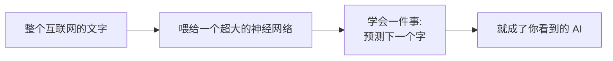

---

## 一、AI 的"前世今生"——一部充满故事的编年史

在我们拆解技术之前，先讲讲 AI 是怎么一步步走到今天的。这段历史不仅有意思，而且**每个转折都对应着今天 AI 的一个能力或局限**。读完你会发现：原来 ChatGPT 不是凭空出现的，它身上每一块拼图都有自己的故事。

### 0.1 史前时代（1950s - 2000s）：AI 的两次"寒冬"

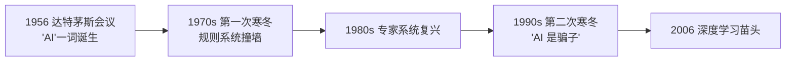

**1956 年夏天，达特茅斯学院**。一群年轻科学家（其中包括后来图灵奖得主 McCarthy、Minsky）开了一个为期两个月的研讨会。会议宣言里第一次出现了 "**Artificial Intelligence**" 这个词。他们当时乐观地认为：**再过 10 年，机器就能像人一样思考。**

结果呢？他们错了——错得很离谱。

接下来 50 年里，AI 经历了两次"寒冬"。每次都是科学家承诺得太多、做不到、政府断了经费、行业崩盘。中间出现过一些有意思的尝试：

- **专家系统**：靠人手工写几万条规则，让计算机模拟医生诊断、律师答疑。结果发现规则越加越多，越来越乱，根本扩展不动。
- **统计 NLP**：放弃规则，改用数学统计。能做翻译，但翻得磕磕巴巴。

> 💡 **关键启示**：人类花了 50 年才明白一件事——**"教"机器是教不会的，得让机器"自己学"**。这就为后来的深度学习埋下了种子。

### 0.2 深度学习的觉醒（2006 - 2012）：三个"叛逆者"的坚持

整个 90 年代，神经网络是一个**被主流抛弃**的方向。当时学术界普遍认为"神经网络又慢又难训、永远做不出有用的东西"。

但有三个人**就是不信邪**：

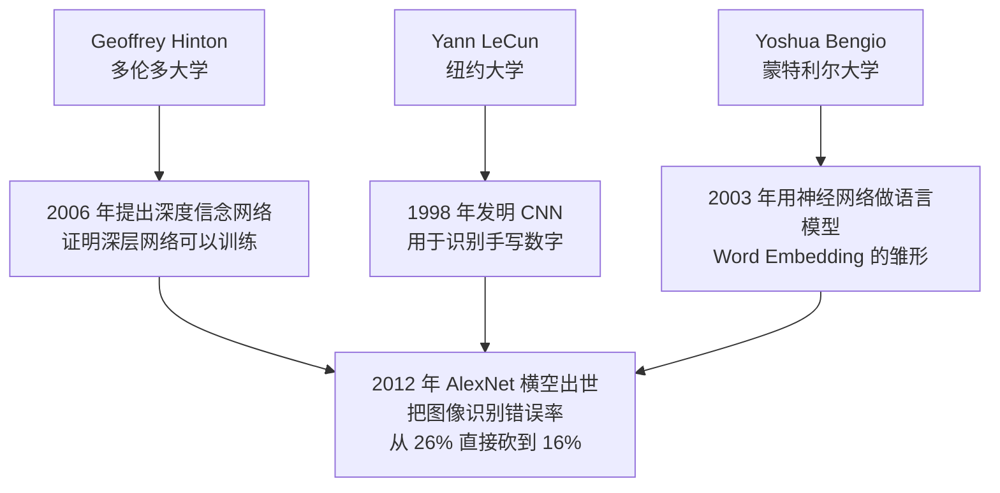

**2012 年是 AI 的"创世纪"年份**。Hinton 的学生 Alex Krizhevsky 用 GPU 训练了一个深度神经网络（AlexNet），在 ImageNet 图像识别比赛中把第二名甩开了 10 个百分点。

这一战的意义在于——**所有人突然意识到：GPU + 大数据 + 深层网络，原来真的可以工作！**

那三位"叛逆者"，2018 年共同拿了**图灵奖**（计算机界的诺贝尔奖）。坚持了 30 年的冷板凳，终于热了。

> 💡 **关键启示**：今天所有 AI 的算力基础是 **NVIDIA 的 GPU**。这家公司原本是做游戏显卡的，从来没想过会成为 AI 时代的卖水人。老黄（黄仁勋）现在是世界级首富——而这一切的起点，就是 2012 年 AlexNet 选择用 GPU 训练。

### 1.3 RNN 的崛起与困境（2013 - 2016）：长文本的"金鱼记忆"

深度学习在图像上爆发后，自然语言处理（NLP）也跟着进入了**深度学习时代**。当时的主角是 **RNN（循环神经网络）** 和它的升级版 **LSTM**。

它们的思路是：处理一句话时，一个词一个词地读，每读一个就更新一下"记忆"。

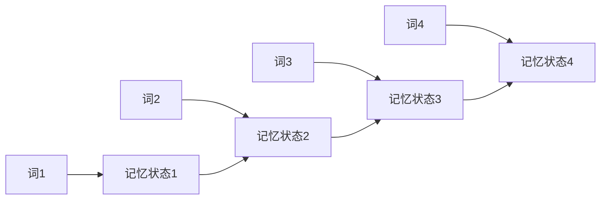

听起来很合理，对吧？但 RNN 有**两个致命缺陷**：

**缺陷一：金鱼记忆**

句子稍微一长，前面的信息就忘了。比如：

> "小明小时候在云南长大，跟爷爷奶奶一起生活了十几年，吃米线、过泼水节，所以他的母语是____。"

RNN 处理到最后那个空时，前面"云南"的信息几乎已经忘光了，它猜不出"傣语"或"普通话"。

**缺陷二：必须按顺序处理，没法并行**

RNN 必须先读完第 1 个词，才能读第 2 个；读完第 2 个，才能读第 3 个……

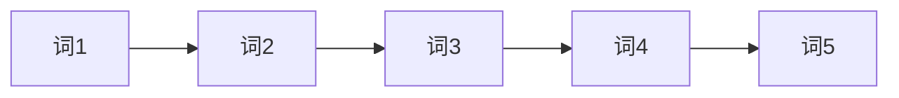

这意味着——**你买再多 GPU 也没用**，因为它们只能干等着。RNN 的训练速度被卡死了。

整个 2013-2016 年，NLP 学术界都在拼命改进 RNN，发明了 LSTM、GRU、双向 RNN、注意力机制（早期版本）……**就是治不好这两个病**。

> 💡 **关键启示**：技术的突破往往不是改良，而是**换一种思路**。RNN 走到了死胡同——救它的不是更聪明的 RNN，而是**把 RNN 整个扔掉**的新架构。

### 1.4 2017 年的"圣经时刻"：Transformer 横空出世

**2017 年 6 月 12 日**，Google 的 8 位研究员（Vaswani、Shazeer、Parmar 等）在 arXiv 上贴了一篇论文:

> **《Attention is All You Need》（你只需要注意力）**

这个标题狂得可以——他们直接说：**之前所有的 RNN、LSTM 都不需要了。只用一个叫"注意力"的机制，就够了。**

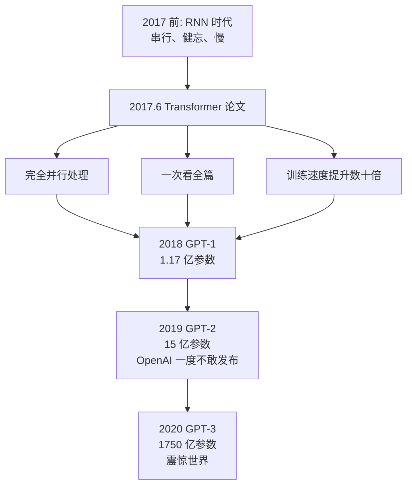

这篇论文有几个**戏剧性的小故事**：

- **8 个作者后来全部离开了 Google**。其中 Noam Shazeer 创办了 Character.AI（2024 年 8 月，Google 用约 27 亿美元的授权交易，把他和团队请回 Google 共同领导 Gemini 项目）；Aidan Gomez 创办了 Cohere（估值已超数十亿美元）；Łukasz Kaiser 去了 OpenAI，参与了 GPT-4 与 o1/o3 的核心研发。**"Transformer 八子"几乎组成了硅谷 AI 圈最贵的同学录**。

- **Google 自己反而错过了大模型时代**。它发明了 Transformer，但因为搜索业务太赚钱、又怕新产品冲击老业务，迟迟没有大规模押注。结果让一个名不见经传的小公司——**OpenAI**——抢了先。

- **论文标题来自一首披头士的歌**：《All You Need Is Love》。作者 Llion Jones 后来回忆，取这个名字"花了五秒钟"，他当时根本没想到大家真会用——结果它成了 AI 史上最著名的论文之一。

### 1.5 OpenAI 的豪赌（2018 - 2022）：把 Transformer 做大

Transformer 出来之后，大部分研究者还在拿它做小规模实验。但**有一家公司决定走极端路线**——这家公司就是 **OpenAI**。

它的思路简单粗暴：

> **Transformer 既然好用，那就把它**做大、做大、再做大。

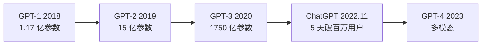

每一代都有戏剧性的事件：

- **GPT-2（2019）**：OpenAI 训完后**吓得不敢全开源**，担心被用来生成假新闻。这一举动在学术界引起轩然大波，被批评"违背开源精神"。但后来事实证明，他们的担心**完全不是多余**——AI 生成内容的滥用问题在 2023 年后真的全面爆发。这东西我带着大家部署过，像个傻狗。[【部署教程】基于GPT2训练了一个傻狗机器人](https://bugstack.cn/md/algorithm/model/2023-02-12-chat-gpt.html)

- **GPT-3（2020）**：1750 亿参数，训练成本业界估算约 **460 万到 1200 万美元**。当时业内很多人质疑："堆参数有意义吗？" 结果 GPT-3 一发布，能写诗、能编程、能模仿任何人的口吻——所有质疑瞬间消失。

- **ChatGPT（2022.11）**：OpenAI 内部其实只是想"小试一下"，把 GPT-3.5 包了个聊天界面，**没人觉得它会火**。结果上线 5 天破 100 万用户，2 个月破 1 亿——成为人类历史上**用户增长最快的产品**（连 TikTok、Instagram 都没这么快）。微软 CEO 纳德拉看到数据后说了一句话："我们要让 Google 跳舞（dance）。"

> 💡 **关键启示**：很多人以为 ChatGPT 是个"突然出现"的产品。其实它是一条**长达 5 年的押注**：OpenAI 从 2018 年就开始押 Transformer + 大规模 + 自回归这条路。**那些看起来一夜爆红的东西，背后都有人在冷板凳上坐了五年十年**。

### 1.6 中国 AI 的奋起直追（2023 - 2025）：从跟跑到部分领跑

ChatGPT 火了之后，中国整个科技圈被打了个措手不及。但中国速度起来后，追赶的速度也惊人。

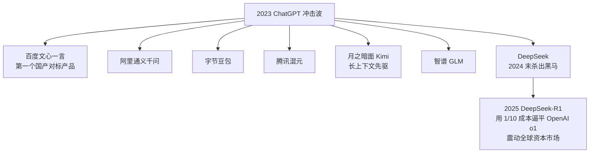

特别值得讲的是 **DeepSeek**：

- 它是一家**杭州的对冲基金（幻方量化）孵化出来的 AI 公司**，没什么明星光环。
- 2024 年 12 月发布 DeepSeek-V3，**V3 的预训练成本约 557 万美元**（基于 2048 张 H800 GPU、约 278 万 GPU 小时），仅为同级别模型的几分之一。
- 2025 年 1 月 20 日发布 DeepSeek-R1（基于 V3 加强化学习训练），**推理能力对标 OpenAI 当时最强的 o1**，**而且完全开源**。
- 这条消息直接引爆全球资本市场：**2025 年 1 月 27 日，NVIDIA 股价单日暴跌约 17%，市值蒸发近 5890 亿美元**——创下美股历史上单只股票单日市值蒸发的新纪录，登上全球财经头条。

中国 AI 从 2023 年的"对标 ChatGPT"，到 2025 年的"在某些方向反过来定义标准"，只用了**两年**。这在科技史上极其罕见。

> 💡 **关键启示**：AI 不是"谁有钱谁赢"的游戏。**算法创新、工程优化、开源共建**，三样东西配齐，小团队也能掀翻巨头。

### 1.7 把历史浓缩成一句话

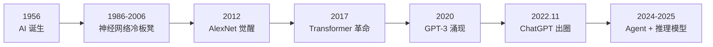

**70 年的 AI 史，可以浓缩成一句话**：

> **人类花了 60 年明白"教不会"，花了 5 年学会"让它自己学"，又花了 5 年发现"做大就行"——然后世界就变了。**

理解了这段历史，你就能理解今天 AI 的每一个特点——为什么必须用 GPU、为什么要堆参数、为什么会有幻觉、为什么 OpenAI 一家独大、为什么开源模型现在能反杀。

下面小傅哥和大家一起，正式进入技术拆解。这部分内容来自于各个 LLM 公司所发布的资料，进行的理解、总结，如果有偏差，可以指出。🍻

---

## 二、AI 到底在做什么？（生活直觉版）

### 2.1 它就是在玩文字接龙

你看到的所有 AI——ChatGPT、豆包、文心一言、Claude、Gemini——它们做的事**只有一件**：

> **看一段话，猜下一个字最可能是什么。**

比如你输入"今天天气真不"，它在脑子里算的是：

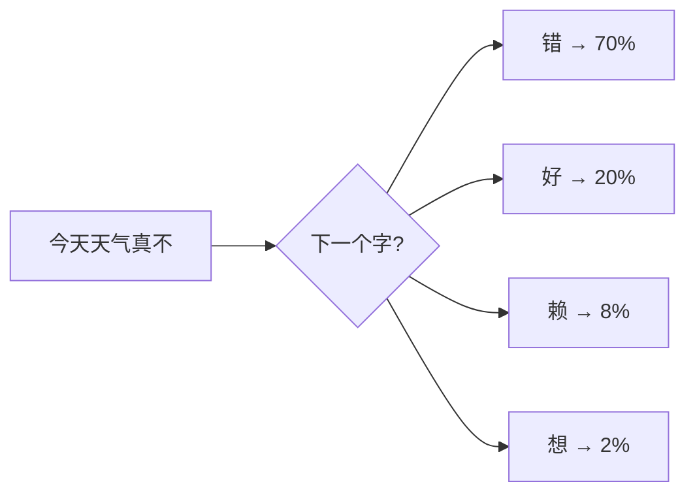

然后它选概率最高的"错"，把"今天天气真不错"作为新的输入，再猜下一个字……

**一个字一个字接龙，最后接出一整段话。** 就这么简单。

> 💡 **这里有个反直觉的事实**：AI 没有"想好一段话再说出来"的能力。它是**边接边说**的，连它自己都不知道这句话最后会说成什么样。

### 2.2 它怎么学会"哪个字概率高"的？

简单一句话：

> **把整个互联网（书、网页、维基、知乎、新闻、论文……）喂给一个超大的神经网络，让它做亿万次"完形填空"练习。**

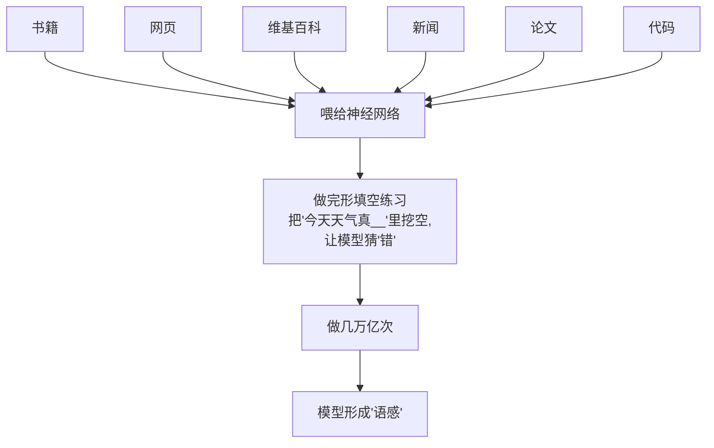

练了几万亿次之后，它就形成了一种**统计上的语感**——知道在什么上下文下，什么字出现概率最高。

> 这是第一层。听懂了这一层，你已经超过了 80% 的人。下面我们往深里走一层。

---

## 三、那"字"在 AI 眼里长什么样？（技术入门）

### 3.1 Token：AI 眼里的"最小单位"

刚才说"猜下一个字"，其实不太准确。AI 处理的最小单位不是"字"，叫 **Token**（中文有时翻译成"词元"）。

Token 可以是：

- 一个英文单词（如 `cat`）
- 一个英文单词的片段（如 `Learn` + `ing`）
- 一个汉字（如 `人`）
- 一个汉字组合（如 `人工` + `智能`，看 tokenizer 怎么切）

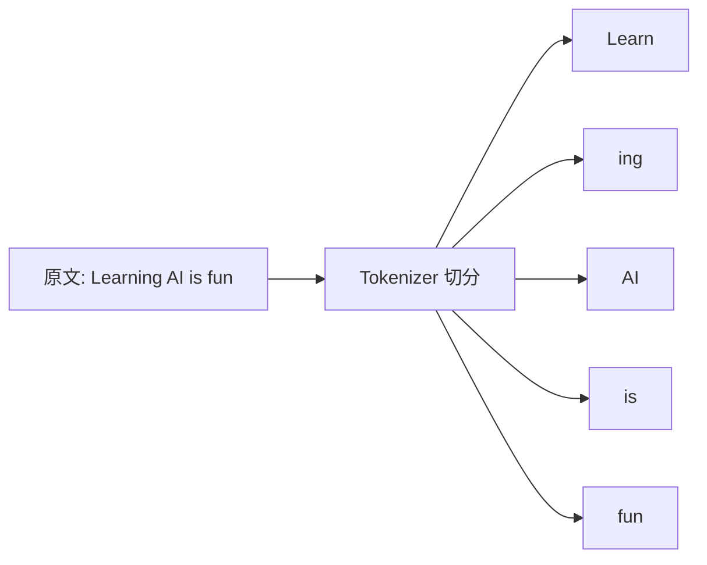

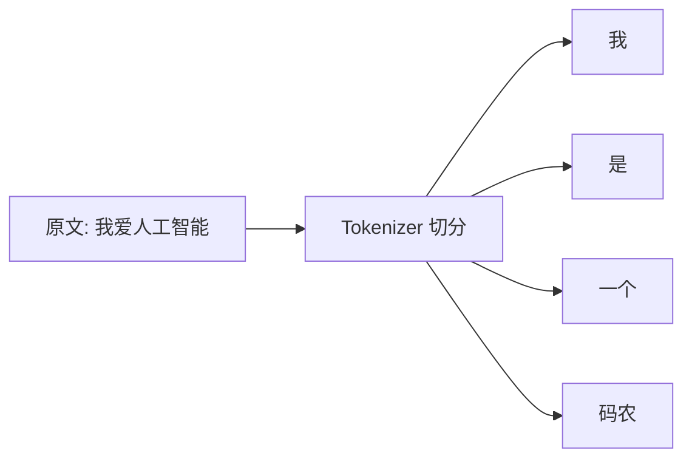

为什么要这么切？因为这样既能覆盖所有词汇（即使是新词、错别字），又能让模型处理的"词表"控制在几万个的规模，不至于爆炸。

> 💡 **冷知识**：你跟 AI 聊天，按 Token 数收费。中文一个汉字大约 1-2 个 Token，英文一个单词大约 1-1.5 个 Token。所以用中文跟 GPT 聊天比英文贵一点。

### 3.2 Token 怎么变成数字？

计算机只认数字。所以每个 Token 在 AI 眼里其实是一个**编号**：

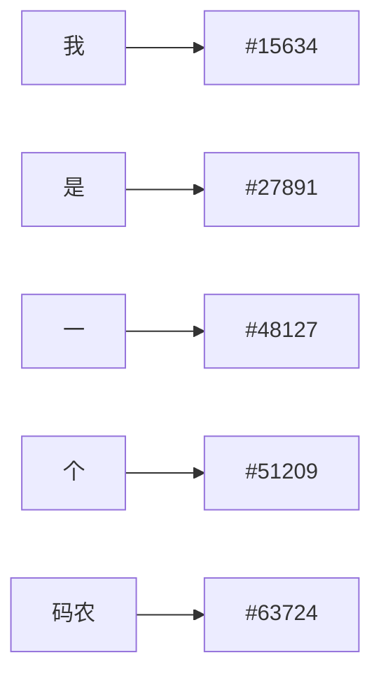

好——但只有编号还不够。"15634"和"27891"在数学上看就是两个数字，没有任何含义。

我们需要让计算机知道：**"我"和"你"很相似，"狗"和"猫"很相似，"苹果"和"香蕉"很相似**。

这就引出了下一个核心概念——

### 3.3 Embedding：把"意思"变成"坐标"

**Embedding** 是 AI 领域最优雅的发明之一。

它的思路是：**给每个词一个高维空间里的坐标**。坐标相近的词，意思就相近。

为了方便理解，我们把"高维空间"简化成二维：

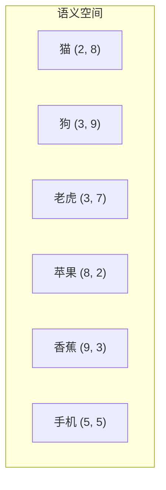

在这个空间里：
- 猫、狗、老虎挤在一起（都是动物）
- 苹果、香蕉挤在一起（都是水果）
- 手机离它们都远（电子产品）

**真实的 Embedding 不是 2 维，而是几百到几千维**。维度越多，能表达的语义关系就越细腻。

**Embedding 最神奇的一点：可以做数学运算**

Word2Vec（Google 2013）发现了一个经典现象：

```text
   vec("国王") - vec("男人") + vec("女人") ≈ vec("女王")
   vec("北京") - vec("中国") + vec("法国") ≈ vec("巴黎")
```

**这意味着语义关系被编码成了"方向"**。"性别"是一个方向，"国家-首都"是另一个方向。

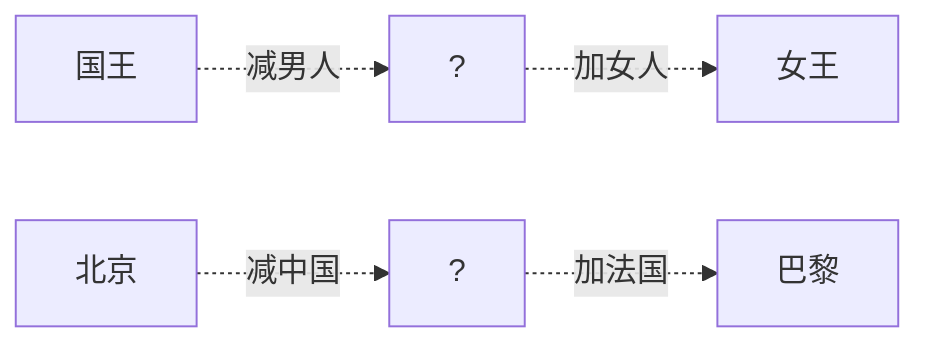

> 💡 **这就是为什么 AI 能"理解"语言**：因为它把所有词变成了坐标，理解就变成了坐标之间的加减乘除——计算机最擅长的事。

到这一层，你已经知道了 AI 处理语言的底层数学了。继续往深走——

---

## 四、手把手教你"算"——Token 和 Embedding 的演进与实战

前面讲了思路，这一节我们**真的动手算**。看完这一节，你能：

- 自己估算一段话有多少 Token
- 自己算两个词之间的"语义距离"
- 知道 Embedding 是怎么"训练"出来的（不是凭空给的坐标）

### A. Token 怎么算？三代演进，由浅入深

#### A.1 第一代：按词切分（Word-level）

最朴素的想法：**遇到空格就切**。

```text
原文：  I love AI
切分：  ["I", "love", "AI"]
Token 数 = 3
```

**问题**：词表会爆炸。英文的"runs / running / ran"会被当成三个完全不同的词；中文更惨——"中国人 / 中国 / 国人"得各占一个位置。最终词表能膨胀到上百万。

#### A.2 第二代：按字符切分（Char-level）

退到极致：**一个字符一个 Token**。

```text
原文：  I love AI
切分：  ["I", " ", "l", "o", "v", "e", " ", "A", "I"]
Token 数 = 9
```

**问题**：词表小了（英文 26 个字母 + 标点就够了），但**序列变得超级长**。一句普通的话拆成几十上百个 Token，模型算起来又慢又笨。

#### A.3 第三代：BPE 子词切分（现代标准）

**BPE（Byte Pair Encoding）**：一种"由数据学出来"的折中方案。

它的思路非常聪明：**让常见的组合保留为一个 Token，少见的拆开**。

举个直观例子，BPE 是这样"训练"出来的：

```text
Step 1: 一开始按字母切
"low low low lowest" → ["l","o","w","l","o","w","l","o","w","l","o","w","e","s","t"]

Step 2: 数哪两个字符相邻出现得最频繁
"l"+"o" 出现了 4 次 → 合并成 "lo"

Step 3: 继续数
"lo"+"w" 出现了 4 次 → 合并成 "low"

Step 4: 继续...
最后形成的词表里就有了 "low" 这个常见单位
而稀有词如 "lowest" 会被切成 "low"+"est"
```

**结果**：常见词整体保留（短而精），罕见词拆成片段（仍能表达）。词表大小被控制在 5 万–10 万之间，覆盖几乎所有可能的输入。

#### A.4 真实 GPT 的切分例子（你可以亲自验证）

下面是一些**真实通过 OpenAI tokenizer 验证过**的 Token 计数（GPT-4 系列使用的 cl100k_base）：

| 原文 | Token 切分（示意） | Token 数 |
|---|---|---|
| `Hello, world!` | `["Hello", ",", " world", "!"]` | 4 |
| `ChatGPT is amazing` | `["Chat", "G", "PT", " is", " amazing"]` | 5 |
| `我爱人工智能` | `["我", "爱", "人工", "智能"]` 或 `["我","爱","人","工","智","能"]` | 4–6 |
| `你好` | `["你","好"]`（每个汉字 1 token，但每个 token 实际占 2-3 字节） | 2 |
| `🚀` | `["🚀"]`（一个 emoji 通常占 2-4 个 byte-level token） | 2–4 |

> 🔧 **想自己验证？** 打开 OpenAI 官方 Tokenizer 页面：[platform.openai.com/tokenizer](https://platform.openai.com/tokenizer)，把任何文本贴进去，它会**实时高亮**告诉你怎么切的、占多少 Token。

#### A.5 一个能用的"心算公式"

工程师常用的近似估算法：

```text
英文：1 token ≈ 0.75 个英文单词 ≈ 4 个英文字符
中文：1 个汉字 ≈ 1.5 ~ 2 个 token
```

**亲自算一下**：

> "今天天气真不错。" — 共 8 个字符（含句号）
> 估算：8 × 1.5 ≈ **12 个 token**（实测 GPT-4：10 个 token，吻合）

> "Hello, my name is GPT-4." — 共 5 个单词 + 标点
> 估算：5 ÷ 0.75 ≈ **7 个 token**（实测：8 个 token，基本吻合）

#### A.6 这能帮你做什么？算钱！

OpenAI GPT-4o 当前价格约（举例）：

```text
输入：$2.50 / 百万 token
输出：$10   / 百万 token
```

**实战**：你写一个客服机器人，每次对话平均：
- 系统 prompt：500 token
- 用户问题：50 token
- AI 回答：300 token

**单次对话成本**：

```text
输入：(500 + 50) tokens × $2.50 / 1,000,000 = $0.001375
输出： 300       tokens × $10   / 1,000,000 = $0.003
合计：≈ $0.0044 / 次对话
```

每天 10000 次对话：**$44/天 ≈ $1320/月**。这就是为什么大型 AI 应用必须精打细算每一个 Token。

---

### B. Embedding 怎么算？从"坐标"到"相似度"

#### B.1 第一代：One-Hot（独热编码）

最早的做法。假设词表有 5 个词：`[猫, 狗, 苹果, 香蕉, 手机]`。

```text
猫    →  [1, 0, 0, 0, 0]
狗    →  [0, 1, 0, 0, 0]
苹果  →  [0, 0, 1, 0, 0]
香蕉  →  [0, 0, 0, 1, 0]
手机  →  [0, 0, 0, 0, 1]
```

**致命问题**：任意两个词的距离都一样（都是 √2），完全没有语义信息。

#### B.2 第二代：共现矩阵（Co-occurrence）

观察："猫"和"狗"经常出现在同一句话里，"猫"和"手机"很少。所以**统计两个词在同一窗口内出现的次数**。

```text
词表：猫 / 狗 / 苹果 / 香蕉 / 手机

共现矩阵（简化）：
        猫  狗  苹果 香蕉 手机
   猫  [ 0,  8,  1,  1,  0 ]
   狗  [ 8,  0,  1,  1,  0 ]
   苹果[ 1,  1,  0,  9,  0 ]
   香蕉[ 1,  1,  9,  0,  0 ]
   手机[ 0,  0,  0,  0,  0 ]
```

**每一行**就是这个词的初代 "Embedding"！你已经能看出来：
- 猫 [0,8,1,1,0] 和 狗 [8,0,1,1,0] 非常像 → 它们语义相近
- 苹果 [1,1,0,9,0] 和 香蕉 [1,1,9,0,0] 非常像 → 它们语义相近

**问题**：维度等于词表大小，太大太稀疏。

#### B.3 第三代：Word2Vec（2013 Google）—— 划时代

把共现矩阵**压缩**到几百维稠密向量。原理简化到极致就是：

> **训练一个小神经网络去做"猜词"游戏：根据中心词猜上下文词。猜对了就调整权重。训练完成后，神经网络中间层的权重，就是每个词的 Embedding。**

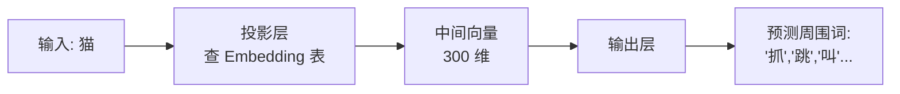

#### B.4 用真实 Embedding 算一次"语义距离"

为了让你看见数字，我们用一个**简化到 4 维**的演示（真实是 300/768/1536 维）：

```text
猫     ≈ [ 0.91,  0.85,  0.10, -0.08]
狗     ≈ [ 0.88,  0.83,  0.12, -0.06]
老虎   ≈ [ 0.82,  0.79,  0.05, -0.10]
苹果   ≈ [ 0.05, -0.12,  0.90,  0.86]
香蕉   ≈ [ 0.08, -0.10,  0.88,  0.91]
手机   ≈ [-0.30, -0.25, -0.40, -0.35]
```

衡量"语义相似度"最常用的是 **余弦相似度（Cosine Similarity）**——也就是衡量两个向量"指向是否接近"。

#### B.5 余弦相似度公式（不要怕，跟着算一遍）

公式：

```text
cosine(A, B) = (A·B) / (|A| × |B|)

其中：
   A·B = a1×b1 + a2×b2 + ... + an×bn   （点积）
  |A|  = √(a1² + a2² + ... + an²)       （向量长度）
```

**手算示例**：算"猫"和"狗"的相似度

```text
A = 猫 = [0.91, 0.85, 0.10, -0.08]
B = 狗 = [0.88, 0.83, 0.12, -0.06]

Step 1: 算点积 A·B
A·B = 0.91×0.88 + 0.85×0.83 + 0.10×0.12 + (-0.08)×(-0.06)
    = 0.8008 + 0.7055 + 0.012 + 0.0048
    = 1.5231

Step 2: 算 A 的长度
|A| = √(0.91² + 0.85² + 0.10² + 0.08²)
    = √(0.8281 + 0.7225 + 0.01 + 0.0064)
    = √1.567
    ≈ 1.2518

Step 3: 算 B 的长度
|B| = √(0.88² + 0.83² + 0.12² + 0.06²)
    = √(0.7744 + 0.6889 + 0.0144 + 0.0036)
    = √1.4813
    ≈ 1.2171

Step 4: 算余弦相似度
cosine(猫, 狗) = 1.5231 / (1.2518 × 1.2171)
              = 1.5231 / 1.5236
              ≈ 0.9997
```

**结论**：猫和狗的相似度 ≈ **0.9997**（满分 1.0），非常相近。

#### B.6 再算"猫"和"手机"对比一下

```text
A = 猫   = [ 0.91,  0.85,  0.10, -0.08]
B = 手机 = [-0.30, -0.25, -0.40, -0.35]

A·B = 0.91×(-0.30) + 0.85×(-0.25) + 0.10×(-0.40) + (-0.08)×(-0.35)
    = -0.273 + (-0.2125) + (-0.04) + 0.028
    = -0.4975

|B| = √(0.09 + 0.0625 + 0.16 + 0.1225) = √0.435 ≈ 0.6595

cosine(猫, 手机) = -0.4975 / (1.2518 × 0.6595)
                = -0.4975 / 0.8255
                ≈ -0.6027
```

**结论**：猫和手机的相似度 ≈ **-0.60**（负数意味着语义相反方向）。

#### B.7 一张表看清楚

| 词对 | 余弦相似度 | 解读 |
|---|---|---|
| 猫 vs 狗 | ≈ 0.9997 | 同类、几乎重合 |
| 猫 vs 老虎 | ≈ 0.997 | 同类、强相关 |
| 苹果 vs 香蕉 | ≈ 0.998 | 同类水果 |
| 猫 vs 苹果 | ≈ 0 | 几乎正交（不相关） |
| 猫 vs 手机 | ≈ -0.60 | 强烈不相关 |

**这就是 RAG（检索增强）的数学基础**：把你的问题变成一个向量，把知识库每段文字变成向量，然后用余弦相似度找最相近的那几段——给 AI 当"参考资料"。

#### B.8 验证经典的"国王 - 男人 + 女人 ≈ 女王"

假设我们有这些向量（演示用，4 维简化）：

```text
国王 = [0.95, 0.20, 0.85, 0.10]
男人 = [0.30, 0.10, 0.80, 0.05]
女人 = [0.30, 0.90, 0.80, 0.05]
女王 = [0.95, 0.95, 0.85, 0.10]
```

**算"国王 - 男人 + 女人"**：

```text
[0.95, 0.20, 0.85, 0.10]
- [0.30, 0.10, 0.80, 0.05]
= [0.65, 0.10, 0.05, 0.05]

[0.65, 0.10, 0.05, 0.05]
+ [0.30, 0.90, 0.80, 0.05]
= [0.95, 1.00, 0.85, 0.10]
```

把结果 `[0.95, 1.00, 0.85, 0.10]` 跟"女王" `[0.95, 0.95, 0.85, 0.10]` 比一比——几乎完全一致！

> 💡 **这就是 Word2Vec 当年震惊学术界的原因**：语义居然真的能像三维空间里的几何向量一样进行加减运算。

#### B.9 真实场景中 Embedding 怎么用？

你完全可以自己上手：

```text
1. OpenAI 提供 text-embedding-3-small 模型
   输入文本 → 输出 1536 维向量

2. 调用一次大约 1024 token 的成本：≈ $0.00002

3. 把你的所有文档都跑一遍 → 存进向量数据库（Pinecone/Milvus/Chroma）

4. 用户提问时:
   - 把问题转成 1536 维向量
   - 在数据库里找余弦相似度最高的 Top-5 段落
   - 把这 5 段 + 用户问题打包发给 GPT-4
   - GPT-4 基于这些"开卷资料"回答
```

**这就是企业 AI 助手的标准做法**。看完这一节，你已经知道它的底层在算什么了。

---

### C. 一句话总结这一层

> Token 是 AI 的"字"，Embedding 是 AI 的"语义坐标"。
>
> **算 Token = 算钱**；**算 Embedding 距离 = 算意思**。
>
> 这两件事是当代 AI 工程最基础、最值钱的两个计算。

---

## 五：AI 怎么"看懂"一整句话？（注意力机制）

### 5.1 一个问题：词序很重要

"小狗咬小孩"和"小孩咬小狗"用了一模一样的词，但意思完全相反。

光有 Embedding 不够，模型必须知道**词和词之间的关系**。

### 5.2 注意力机制：让每个词"环顾四周"

2017 年 Google 提出了 **Transformer 架构**，里面最核心的发明叫 **Self-Attention（自注意力）**。

它的思路用大白话说就是：

> **每个词在被理解的时候，都要回头看一下句子里的其他词，给每个词分配一个"关注度"。**

比如这句话："**那只猫**因为太累了，所以它睡着了。"

模型在处理"它"这个词时，会做什么？

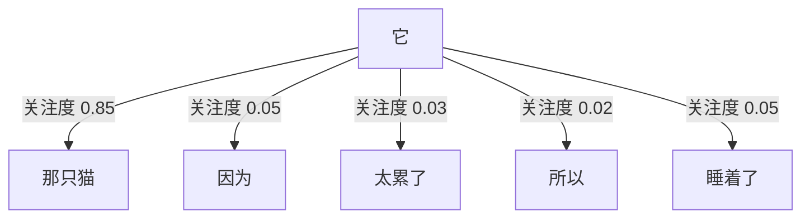

"它"这个词，把 85% 的注意力都放到了"那只猫"上——所以模型知道："它"指的是"那只猫"。

**这就是 AI 能"看懂"语言指代、上下文、长距离关系的原因。**

> 📖 **幕后故事：注意力机制是怎么"反客为主"的**
>
> 注意力机制最早不是为了取代 RNN 而生的，它本来只是 RNN 的一个**辅助插件**——2014 年 Bengio 团队为了让翻译模型记住更长的句子而发明。
>
> 当时大家把它当成"调味料"：往 RNN 里加一勺，效果更好。
>
> 直到 2017 年那 8 个 Google 研究员做了一件事——他们想："**既然注意力这么好用，那干脆把 RNN 全删了，只留注意力呢？**"
>
> 当时连他们自己都没把握。结果一上线，**所有人都傻眼了**：不仅效果好，速度还快了几十倍。
>
> 这就是 AI 史上著名的"调味料反客为主"事件。**很多颠覆性的创新，都不是设计出来的，是"试出来的"**。

### 5.3 整张图：一段话进入模型后发生了什么

把前面学的串起来，看一段文本是怎么流过 AI 大脑的：

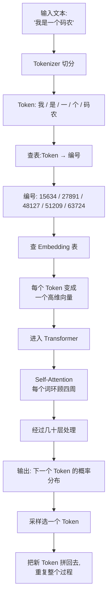

> 💡 这就是 GPT 系列、Claude、Gemini、文心、通义、DeepSeek……**所有现代大模型的统一架构**。

---

## 六、模型是怎么"学会"这一切的？（训练）

到现在为止，我们讲的都是**模型已经训练好之后**怎么用。那它最开始是怎么学会的？

现代大模型的训练分**三步**，缺一不可。

### 6.1 第一步：预训练（Pre-training）—— 让 AI "读完整个互联网"

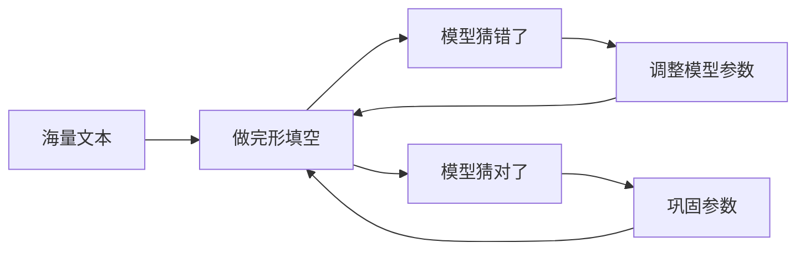

- **目标**：学会语言规律和世界知识
- **数据**：几十 TB 的网页、书籍、代码
- **方法**：不停做完形填空
- **代价**：需要几千张顶级 GPU、训练几个月、烧掉几千万到几亿美元

这一步完成后，模型已经知识渊博，但**不太会聊天**——你问一句它可能给你接龙一段维基百科。

### 6.2 第二步：监督微调（SFT）—— 教 AI "怎么好好说话"

```mermaid
graph LR
    A[人工写的高质量对话] --> B[喂给模型]
    B --> C["模型学会:<br/>遇到问题该这样回答"]
```

- **目标**：让模型学会"对话格式"和"指令遵循"
- **数据**：几万到几十万条人工精心编写的"问-答"对
- **方法**：让模型模仿优秀回答

这一步之后，模型会聊天了，但还会出现各种**不太合适**的回答——比如说脏话、给危险建议、答非所问。

### 6.3 第三步：RLHF —— 让 AI "懂人话、合人意"

RLHF = **基于人类反馈的强化学习**。这是 ChatGPT 真正惊艳世人的秘密武器。

```mermaid
graph TB
    A["同一个问题<br/>让模型生成多个回答"] --> B["人类标注员排序<br/>这个比那个好"]
    B --> C["训练一个'评分模型'<br/>学会模仿人类喜好"]
    C --> D["让主模型生成回答<br/>评分模型打分"]
    D --> E["根据分数<br/>用强化学习调整主模型"]
    E --> D
```

- **目标**：让模型回答**符合人类偏好**——有用、诚实、无害
- **数据**：人类对模型回答的偏好排序
- **方法**：强化学习

> 💡 **这里有个有趣的副作用**：RLHF 后的模型，会变得"过度自信"和"过度礼貌"。因为人类标注员喜欢自信、礼貌的回答。所以现代 AI 模型反而更容易**装作自己什么都知道**——这就是幻觉的一个根源。

> 📖 **幕后故事：ChatGPT 那 5 万小时的"血汗"**
>
> RLHF 听起来很高大上，但它其实极其依赖**人**。
>
> 训练 ChatGPT 时，OpenAI 雇了大量的标注员（很多是肯尼亚的外包公司），给模型生成的成千上万条回答**做排序**："这条比那条好"、"这条有害"、"这条更礼貌"……
>
> 据 *Time* 杂志报道，肯尼亚的标注员时薪不到 2 美元，每天要看大量包含暴力、色情、仇恨内容的文本，**心理负担巨大**。这是 ChatGPT 光鲜表面下不为人知的一面。
>
> 这件事也说明了一个事实：**AI 不是凭空"学聪明"的，它的每一点"懂事"，背后都是大量人类的劳动**。下次你跟 ChatGPT 聊天觉得它特别贴心时，可以记住——那贴心是几千个人手把手"调教"出来的。

### 6.4 训练全景图

```mermaid
graph LR
    A[互联网海量文本] --> B["Step 1: 预训练"]
    B --> C["基础模型<br/>知识渊博但不会聊天"]
    C --> D["Step 2: SFT 微调"]
    D --> E["对话模型<br/>会聊天但偶尔失控"]
    E --> F["Step 3: RLHF"]
    F --> G["最终模型<br/>有用 / 诚实 / 无害"]
    G --> H[发布给用户]
```

---

## 七、为什么"大"模型才有用？（涌现）

### 7.1 一个奇怪的现象

研究人员发现一个反直觉的现象：

- 模型小的时候，做某项任务的能力 = 0
- 模型变大一点，能力还是 = 0
- 模型再变大，能力依然 = 0
- ……
- 模型大到某个临界点，**能力突然跳到 80%！**

这个现象叫 **涌现（Emergence）**。

```mermaid
graph LR
    A["1亿参数<br/>不会做数学"] --> B["10亿参数<br/>还是不会"]
    B --> C["100亿参数<br/>仍然不会"]
    C --> D["1000亿参数<br/>突然会了!"]
```

### 7.2 一个生活化的类比

想象小孩学语言：

- 6 个月：什么都不会说
- 12 个月：会说"妈妈、爸爸"
- 18 个月：还是只会单词
- **2 岁：突然开始说完整句子**

不是大脑容量缓慢提升，是**积累到了某个量级，质变才发生**。

大模型也是这个道理。

### 7.3 哪些能力是"涌现"出来的？

- **逻辑推理**：能做多步数学题
- **代码能力**：能写出能跑的程序
- **跨语言翻译**：没专门训练过中翻法，也能做
- **角色扮演**：能稳定扮演一个角色
- **指令遵循**：能按你说的格式输出

> 💡 这就是为什么"小模型"和"大模型"不仅仅是程度差异，而是**能力级别的差异**。这也是为什么各家公司在拼命堆参数。

> 📖 **现实拷问：为什么 Qwen 0.6B 比 Qwen 9B 差那么多？**
>
> 你下载过 Ollama 或者 LM Studio 的话，会看到同一个家族（比如 Qwen、Llama、DeepSeek）有一堆不同尺寸：0.5B / 1.5B / 3B / 7B / 9B / 14B / 32B / 72B……
>
> 一个特别常见的疑问是：
>
> > **"模型名字都一样、训练数据也都一样，凭什么 9B 就能聊天写代码，0.6B 连话都说不利索？参数量才差 10 几倍而已啊？"**
>
> 这正是"涌现"在你电脑上的真实写照。我们一层层拆开看。
>
> ---
>
> **① 参数差 10 倍，"知识容量"差的可不止 10 倍**
>
> 大模型本质是把世界知识"压缩"进参数里（前面讲过的有损压缩）。
>
> - 0.6B 模型 = 约 0.6 GB（FP16）= 一本小百科全书的容量
> - 9B 模型 = 约 18 GB = 大约一座小型图书馆
>
> 但**知识不是线性增长的**。0.6B 必须做艰难的取舍——哪些常识保留？哪些专业领域舍弃？最后保留下来的只是"语言的形状"和最高频的事实。问它"乔布斯哪年去世"它可能瞎编；问它"红楼梦谁写的"它也未必能稳。
>
> 9B 大到能同时塞下：通用常识 + 多种语言 + 数学公式 + 编程语法 + 文学风格……一个网络里塞十几个"子专家"，而 0.6B 只能塞一个糊涂的"通才"。
>
> ---
>
> **② 涌现能力的"门槛"，0.6B 根本没跨过去**
>
> 大模型有些能力是"全有或全无"的，存在一个最低参数门槛：
>
> | 能力 | 大约门槛 | 0.6B 表现 | 9B 表现 |
> |---|---|---|---|
> | 流畅说人话 | ~0.3B | 勉强能 | 很自然 |
> | 跟从复杂指令 | ~1B | 经常跑偏 | 大体能跟 |
> | 简单数学（两位数运算） | ~3B | 几乎不行 | 能做对一部分 |
> | 多步推理 / Chain-of-Thought | ~7B | 完全做不到 | 开始有 |
> | 写能跑的代码 | ~7B | 极不稳定 | 简单题能写 |
> | 角色扮演 / 长对话保持人设 | ~7B | 几轮就乱 | 稳定 |
>
> 这就像盖楼——**没盖到 5 层之前，你装电梯没意义**。0.6B 的容量根本"撑不起"推理这种复杂能力。
>
> ---
>
> **③ 一个更深的原因：模型不仅在记知识，还在记"思考的回路"**
>
> 大模型内部有研究者发现了所谓的"电路（circuit）"——多个神经元协同实现某种功能，比如：
>
> - **指代消解电路**：理解"它"指代前面哪个名词
> - **算术电路**：执行多步加减
> - **括号匹配电路**：写代码时配对 `{` `}` `(` `)`
>
> 这些电路通常需要**几亿到几十亿参数**才能稳定形成。0.6B 模型连这些"思考的回路"都没长出来，所以它的失败不是"知识不够"，而是**根本没装上这些功能模块**。
>
> ---
>
> **④ 实战对比：一个真实的题目，三个尺寸的回答**
>
> 题目：**"小明有 12 个苹果，分给 3 个朋友，每人一样多。如果再给每个朋友 2 个，每人现在有多少？"**
>
> - **Qwen 0.6B 回答（典型）**："小明给每个朋友 4 个苹果。" ❌（没算第二步）
> - **Qwen 3B 回答（典型）**："每人分到 4 个，再加 2 个，所以是 6 个。" ✅（步骤简单，但能对）
> - **Qwen 9B 回答（典型）**："第一步：12÷3 = 4。每人 4 个。第二步：再加 2 个，每人 4+2 = 6 个。最终答案：每人 6 个苹果。" ✅✅（步骤清晰、过程可验证）
> - **Qwen 32B 回答**：可能还会主动给一个表格、举一反三、提示你"如果数字变成 15 怎么算"。
>
> 注意——**不只是"对/错"的差别，是"会不会思考"的差别**。
>
> ---
>
> **⑤ 那 0.6B 还有用吗？有！但要用对地方**
>
> 别看 0.6B"傻"，它有**致命的优势**：
>
> - **快**：在普通手机/树莓派上都能跑，延迟几十毫秒
> - **小**：500MB 以下，能塞进任何设备
> - **便宜**：API 价格可以低到 9B 的 1/20
>
> 所以它的舞台是：**简单分类、智能路由、标题生成、关键词抽取、敏感词过滤**——这些任务你用 9B 是浪费，用 0.6B 又快又便宜。
>
> 业界一个很火的设计模式叫 **"模型路由器"**：
>
> ```text
> 用户问题 → 0.6B 模型先判断"这是个简单问题还是复杂问题？"
>           ↓
>      简单 → 给 3B 模型回答（便宜）
>      复杂 → 给 70B 模型回答（贵但准）
> ```
>
> 这样既能保证质量，又能把成本压低 80%。
>
> ---
>
> **⑥ 一句话总结**
>
> > **小模型不是"差版本"，是"完全不同的物种"。**
> > **0.6B 是麻雀**（敏捷、便宜、做小事），**9B 是中型鸟**（能飞远），**70B 是猛禽**（能抓大猎物）。
> > 不存在"以小搏大"，只存在"用对地方"。
>
> 选模型的核心心法：**先问任务复杂度，再选参数尺寸**。不要一上来就用最大的，也别奢望小模型干大事。

> 📖 **幕后故事：GPT-3 是怎么让全世界改变看法的**
>
> 2020 年 5 月，OpenAI 发布 GPT-3。当时业内的反应是分裂的：
>
> - **学术界**：嗤之以鼻。"不就是个更大的 GPT-2 吗？没有任何架构创新，靠堆参数算什么科研？"
> - **工程师圈**：开始疯传一些 demo。
>
> 然后真正改变历史的事件发生了——**一位推特用户 Sharif Shameem 用 GPT-3 做了个 demo**：他对着 GPT-3 用自然语言描述："我要一个有红色按钮的页面，按钮下面有一段欢迎文字。" GPT-3 直接生成了能跑的 HTML 代码。
>
> 这条推特一夜爆红。所有人才意识到：**这玩意儿不是"更好的语言模型"，它是个"通用任务求解器"**。
>
> 没人教过 GPT-3 怎么写 HTML，没人专门训练过它"理解 UI 描述"。它就是在预训练里**自己学会了**。
>
> 这就是涌现最让人震撼的地方——**模型在某个尺寸之后，开始"举一反三"**。这种能力不是任何研究员设计出来的，**它是"长出来"的**。这件事也彻底改变了整个 AI 行业的研究方向：从"我设计什么算法"变成了"我怎么把模型做得更大"。

---

## 八、为什么 AI 会"胡说八道"？（幻觉的本质）

终于到了大家最关心的问题。

### 8.1 幻觉不是 Bug，是机制决定的

回到我们最开始的核心比喻：**AI 是文字接龙选手**。

它的工作原理是"必须接出下一个字"。它**没有**：

- ❌ "我不知道"的开关
- ❌ 一个事实数据库可以查
- ❌ 区分"真"和"假"的能力

它只有一个**概率分布**。

```mermaid
graph TB
    A["你问:'某某公司在上海的地址?'"] --> B{模型怎么想}
    B --> C["训练数据里这类问题<br/>通常会跟一个具体地址"]
    C --> D[那我也接一个像样的地址]
    D --> E["输出: 上海市浦东新区...<br/>编出一个完全不存在的地址"]
```

它不是"故意撒谎"——**它根本不知道什么叫"撒谎"**。

它只是在做它最擅长的事：**让接出来的话看起来通顺、合理、像那么回事**。

### 8.2 幻觉的数学必然性

2024 年 OpenAI 自己发了一篇论文 *Why Language Models Hallucinate*，证明了一件事：

> **在标准的训练和评测体系下，"猜一个"比"承认不知道"得分更高。所以模型会被训练成"宁可瞎编也不空着"。**

这意味着幻觉**不能靠堆参数消除**，必须靠**外部系统**解决。

### 8.3 工程上怎么对付幻觉？

业界的标准做法叫 **RAG（检索增强生成）**：

```mermaid
graph LR
    A[用户提问] --> B["先去你的知识库<br/>检索相关资料"]
    B --> C["把资料塞给 AI<br/>说: 基于这些资料回答"]
    C --> D["AI 不再凭空编造<br/>而是基于资料组织答案"]
```

打个比方：

- **没 RAG** = 让学生闭卷考试 → 容易瞎编
- **用 RAG** = 让学生开卷考试 → 答案有根有据

```mermaid
graph TB
    A["公司内部文档<br/>产品手册<br/>知识库"] --> B[切成小块]
    B --> C["计算每块的 Embedding<br/>存进向量数据库"]
    D[用户提问] --> E["计算问题的 Embedding"]
    E --> F["从向量数据库<br/>找最相似的几块"]
    C --> F
    F --> G["把这几块 + 用户问题<br/>一起发给大模型"]
    G --> H[模型基于资料生成答案]
```

> 💡 **这就是为什么"企业内部 AI 助手"基本都是 RAG 架构**：你不能让通用 AI 知道你公司内部的事，但你可以"开卷"让它现场查。

---

## 九、AI 不只是聊天——Agent 时代来了

### 9.1 从"会说"到"会做"

到目前为止，我们讲的 AI 都只能"输出文字"。但 2024 年开始，业界进入了 **Agent（智能体）** 时代。

什么是 Agent？一句话：

> **会用工具、能完成任务的 AI。**

```mermaid
graph TB
    A["传统 AI: 只会输出文字"]
    B["Agent: 会用工具、能采取行动"]

    A --> A1[你问天气]
    A1 --> A2[它瞎编一个天气]

    B --> B1[你问天气]
    B1 --> B2["它调用天气 API"]
    B2 --> B3[拿到真实数据]
    B3 --> B4[告诉你准确天气]
```

### 9.2 Agent 的核心组件

```mermaid
graph TB
    A[用户任务] --> B["Agent 大脑<br/>大模型"]
    B --> C{需要做什么?}
    C --> D[调用搜索引擎]
    C --> E[执行代码]
    C --> F[读取数据库]
    C --> G[发送邮件]
    C --> H[操作浏览器]
    D --> I[拿到结果]
    E --> I
    F --> I
    G --> I
    H --> I
    I --> J{任务完成?}
    J -->|没有| C
    J -->|完成| K[输出最终结果]
```

简单说，Agent = **大模型 + 工具集 + 一个循环**：

1. 看任务
2. 想想要不要用工具，用哪个
3. 用工具，拿到结果
4. 想想下一步
5. 循环，直到任务完成

### 9.3 真实世界的 Agent 例子

- **Cursor / Claude Code / WaLiCode**：你说"帮我把这个功能改成异步的"，它自己读代码、改代码、跑测试。
- **Devin**：号称"AI 软件工程师"，能从一个 GitHub Issue 开始，自己分析、修代码、提 PR。
- **企业客服 Agent**：用户问问题，它查订单、查物流、查退款政策、给出处理方案。

### 9.4 Agent 的现状：很美好，但很难

实话说，Agent 目前还远没到"完全替代人"的地步。原因：

```mermaid
graph LR
    A["第1步: 90% 正确"] --> B["第2步: 90% 正确"]
    B --> C["第3步: 90% 正确"]
    C --> D["..."]
    D --> E["第10步:<br/>整体正确率 = 0.9 的 10 次方 ≈ 35%"]
```

**每一步都可能出错，错误会累积**。所以现在所有靠谱的 Agent 都不是"完全自主"，而是：

> **把工作流程画成一张图，AI 在图上"沿着轨道走"，关键节点由 AI 决策，但整体框架由人定。**

这叫 **Workflow + LLM**，是目前最务实的工业级 Agent 模式。

> 📖 **幕后故事：Devin 的"过山车"与 DeepSeek-R1 的"低成本奇迹"**
>
> **Devin 的故事**：2024 年 3 月，Cognition Labs 发布了 Devin，宣称是"世界上第一个 AI 软件工程师"。演示视频里它从看 Issue、读代码、写代码、跑测试、提 PR 一气呵成，**整个硅谷都疯了**。公司估值一夜从 0 飙到 20 亿美元。
>
> 但几个月后，AI 评测博主 *Internet of Bugs* 发了一条扒皮视频，逐帧分析 Devin 的演示——**发现里面有大量精心剪辑、跳过失败、反复重试**。真实使用率远低于演示。
>
> 这给整个行业泼了一盆冷水，让大家清醒过来：**Agent 离"完全自主"还很远，目前最务实的方向是"AI 加速人，而不是替代人"**。Cursor、Claude Code 这种"AI 提议、人确认"的模式，反而活得最滋润。
>
> **DeepSeek-R1 的故事**：2025 年 1 月 20 日，杭州一家叫 DeepSeek 的小公司发布了 R1 模型——**推理能力对标 OpenAI 当时最贵的 o1，而背后的基础模型 V3 训练成本约 557 万美元**（OpenAI 同级模型据估算花了上亿美元）。更狠的是：**完全开源、技术报告全公开**。
>
> 这一事件直接引发了**全球资本市场地震**：2025 年 1 月 27 日，NVIDIA 股价单日暴跌约 17%、市值蒸发近 5890 亿美元，刷新美股单日单股市值蒸发纪录。原因很简单——如果顶级 AI 能用 1/20 的成本做出来，那"无脑买卡"的逻辑就动摇了。
>
> R1 还有一个更重要的技术贡献：它证明了**仅靠强化学习（R1-Zero 阶段），不经过 SFT，模型就能自发学会推理、反思、自我纠错**。这是大模型领域近三年最重要的发现之一。
>
> 这两个故事合在一起说明一件事——**AI 行业现在的速度，是按"周"在变化的**。今天的明星，下个月可能就被反超；今天看似遥不可及的能力，明年可能开源到你能在自己电脑上跑。**保持学习、不要押宝任何单一技术**，是这个时代的生存之道。

---

## 十、未来三年，AI 会变成什么样？

最后给你看一张全局图，整个 AI 工业栈大概长这样：

```mermaid
graph TB
    A["基础大模型层<br/>GPT-4 / Claude / Gemini / DeepSeek / Qwen"]
    A --> B["能力增强层<br/>RAG / Function Calling / 长上下文"]
    B --> C["Agent 编排层<br/>LangChain / LangGraph / AutoGen"]
    C --> D["应用层<br/>Cursor / Devin / 各种 AI 助手"]
    D --> E[用户]
```

未来三年值得关注的几条线：

1. **推理时计算（Test-Time Compute）**：让模型"想得更久 = 答得更准"。OpenAI o1/o3、DeepSeek-R1 已经验证了这条路。
2. **多模态**：从只懂文字，到能看图、听音、操作屏幕、控制机器人。
3. **长期记忆**：让 AI 记住你是谁、跟你聊过什么，跨会话保留。
4. **AI 原生应用**：不是给老软件加 AI，而是从头设计的 AI-first 产品。（可能的最终形态）

---

## 十一、用今天学的理论，看懂你昨天遇到的 AI

讲了这么多概念，你可能想问：**这些理论跟我每天用 AI 的体验有啥关系？**

关系大了。我们挑 6 个**几乎人人都遇到过**的真实场景，用前面学的理论给你"翻译"一下——你会发现，**所有看起来奇怪的 AI 行为，背后都有原因**。

### 场景 1：每次问同一个问题，AI 给的答案都不一样

> "我昨天问它写朋友圈，今天再问，文案完全不一样了。它不记得我吗？"

**用理论解释**：

- 它**真的不记得**——除非你在同一个对话窗口。每次新对话，AI 是"白纸一张"。
- 即使同一对话，它的输出也带**采样随机性**（Temperature 参数）。同样的"下一个 token 概率分布"，每次采样都可能采到不同的词。
- 这是 **第一层「文字接龙」+ Temperature 机制** 在起作用。

**怎么用**：
- 想要稳定结果（写代码、抽取数据）→ 让对方降低 temperature 或明确说"请给确定的答案"
- 想要创意发散（起名、文案）→ 让它多生成几个版本

---

### 场景 2：让它写一篇 5000 字的长文，越往后越"水"、越跑题

> "前 1000 字写得挺好，后面就开始重复、说废话、甚至偏离主题。"

**用理论解释**：

- 这就是 **第三层提到的注意力机制**和 **第六层提到的"Lost in the Middle"** 的工程后果。
- AI 写到后面时，前面已经写过的内容塞在它的"上下文"里。**上下文越长，每个 token 分到的"注意力预算"就越少**——它就开始"看不清"自己之前写了什么。
- 加上"接龙"特性，前面如果出现一个偏题的句子，后面会沿着这条偏题路径越走越远。

**怎么用**：
- 别让它一次写 5000 字。**拆成"先写大纲 → 逐节展开"**。
- 长文写完后让它**重新校对一遍主题一致性**。

---

### 场景 3：明明很简单的算术题，AI 都能算错

> "我让它算 23 × 47，它给了我一个看起来很对但实际错了的数。"

**用理论解释**：

- 回到 **第一层**：AI 是**接龙**，不是计算器。它生成 23×47 的结果时，是在"猜下一个数字最可能是什么"，**不是真的在做乘法**。
- **第六层「幻觉」** 也在这里发挥：它不会承认"我算不来"，会硬着头皮编一个看起来合理的数字。

**怎么用**：
- 让它**列出计算步骤**（"先算个位、再算十位"），借助"Chain-of-Thought"机制，准确率会显著提升。
- 涉及钱、统计、严肃数据 → **永远用计算器/代码再核对一遍**。
- 高级用法：让它"用 Python 算"，让 AI 调用工具（**第七层 Function Calling**）。

---

### 场景 4：问"现在比特币多少钱"，它说一个 2 年前的数字

> "我问它今天的天气、最新新闻、股价，它给的全是过时的。"

**用理论解释**：

- **第四层「训练」** 告诉我们：模型的知识来自**训练数据**，训练数据有**截止日期**。
- 一旦训练完成，模型就"冻结"了——它不会自己上网。
- 它给的"实时"数字，本质上是**幻觉**——基于过去数据猜了一个"合理的样子"。

**怎么用**：
- 实时信息 → **用带"联网搜索"功能的模式**（ChatGPT 的搜索按钮、Perplexity、豆包联网模式）。
- 这背后就是 **第七层 Agent 的工具调用** —— AI 自己去搜索引擎查，再回答你。

---

### 场景 5：上传一份 100 页 PDF，问里面的细节它答错

> "我把公司年报扔给它，问'第三季度净利润',它给的数字跟原文对不上。"

**用理论解释**：

- 这是经典的 **"长上下文塌陷"**（前面提过）。100 页 PDF 大约 5-10 万 token，**中段信息最容易被忽略**。
- AI 在长文档里"指认"具体数字时，注意力可能根本没真正聚焦到原文那一行。

**怎么用**：
- **不要扔整本**。先让它生成目录或摘要 → 再针对你关心的章节单独提问。
- 或者用支持 **RAG（第六层「开卷考试」）** 的工具：把 PDF 切片入库，提问时只检索相关片段给 AI。
- 关键数字 → **永远要求它"原文引用"**——它就不容易瞎编。

---

### 场景 6：同一个 Qwen 模型，0.6B 答非所问，9B 又快又准

> "都叫 Qwen，参数差 10 几倍，结果天差地别。"

**用理论解释**：

- 这就是 **第五层「涌现」** 的现实写照。
- 推理、跟从复杂指令、写代码——这些是**有门槛的能力**，0.6B 根本没跨过去。
- 不是"差一点"，是**"完全没装上这个功能模块"**。

**怎么用**：
- 简单任务（分类、关键词、标题）→ 用 0.6B / 1.5B，便宜又快。
- 严肃任务（写代码、写报告）→ 至少 7B 起步。
- 高级用法：用**模型路由器**（小模型先判断、再决定派给谁），成本可降 80%。

---

### 一张总结表：一眼看懂"理论 → 现象 → 对策"

| 你遇到的现象 | 背后理论 | 对策 |
|---|---|---|
| 答案每次都不一样 | 文字接龙 + Temperature | 降温 / 明确要求 |
| 长文越写越水 | 注意力被稀释 / Lost in the Middle | 分段写、写完再校 |
| 算术错得离谱 | 接龙 ≠ 计算 + 幻觉 | 列步骤 / 用工具 |
| 实时信息过时 | 训练数据有截止日期 | 开联网模式 |
| 长 PDF 答错细节 | 长上下文塌陷 | 切片提问 / 要求原文引用 |
| 小模型答非所问 | 涌现门槛 / 容量不够 | 选对参数尺寸 |

> 💡 **学习 AI 最好的方式，不是背概念，是在你下次踩坑时——能立刻说出"这是哪个机制在作怪"**。
>
> 当你能用"上下文塌陷"解释一次长文档失误，用"涌现"解释一次模型升级带来的飞跃——你就真正"懂 AI 了"。

---

## 终章：把整个故事串起来

最后用一张图，把这篇文章讲的所有概念串成一个完整的故事：

```mermaid
graph TB
    subgraph 1.数据准备
        A1[整个互联网文本]
    end

    subgraph 2.基础表示
        B1["Tokenizer 切分"]
        B2["Embedding 把词变坐标"]
    end

    subgraph 3.架构核心
        C1["Self-Attention<br/>每个词看其他词"]
        C2["Transformer 几十层堆叠"]
    end

    subgraph 4.训练
        D1["预训练: 完形填空"]
        D2["SFT: 学会聊天"]
        D3["RLHF: 符合人类偏好"]
    end

    subgraph 5.涌现的能力
        E1[语言]
        E2[推理]
        E3[代码]
        E4[翻译]
    end

    subgraph 6.局限
        F1[幻觉]
        F2[知识过时]
        F3[数学差]
    end

    subgraph 7.工程对策
        G1["RAG 开卷考试"]
        G2["Function Calling 用工具"]
        G3["Agent 自主完成任务"]
    end

    A1 --> B1 --> B2 --> C1 --> C2 --> D1 --> D2 --> D3 --> E1
    D3 --> E2
    D3 --> E3
    D3 --> E4
    E1 --> F1
    E1 --> F2
    E1 --> F3
    F1 --> G1
    F2 --> G1
    F3 --> G2
    G1 --> G3
    G2 --> G3
```

读完这篇文章，根据你的理解程度，可以分成三档：

| 档位 | 你应该能说出 |
|---|---|
| **入门** | AI 是文字接龙，会胡说，得自己核对 |
| **进阶** | AI 把词变成坐标，靠注意力理解上下文，靠预训练+SFT+RLHF 三步学习 |
| **熟手** | 我知道大模型 + RAG + Agent + MCP（后续分享） + Skills（后续分享） 怎么组合，能跟工程师讨论方案 |

如果你看完只到了"入门"档，也没关系——把这篇文章收藏，过一周再读一遍，你会发现很多之前没注意的细节变清晰了。

**理解 AI 是这个时代的复利能力。早一点搞明白，未来几年的红利就早一点吃到。**

---

## 附：本文涉及的核心概念速查表

| 概念 | 一句话解释 |
|---|---|
| **Token** | AI 眼里的最小单位，像字也像词 |
| **Embedding** | 把词变成多维空间里的坐标，坐标近 = 意思近 |
| **Self-Attention** | 每个词去"环顾"句子里的其他词，理解关系 |
| **Transformer** | 把 Attention 堆叠几十层形成的大脑结构 |
| **预训练** | 喂海量文本做完形填空，让模型学到语言和知识 |
| **SFT** | 用高质量对话样本，教模型怎么聊天 |
| **RLHF** | 用人类偏好反馈，让模型变得更"懂人" |
| **涌现** | 模型大到某个临界点，新能力突然出现 |
| **幻觉** | AI 编造看似合理但实际错误的内容 |
| **RAG** | 检索增强生成 = 让 AI 开卷考试 |
| **Function Calling** | 让 AI 会调用外部工具 |
| **Agent** | 会用工具、能完成任务的 AI |

把这张表存下来，下次看到这些词，你就不会再发怵了。**愿你不仅会用 AI，也理解 AI；不仅不被它取代，还能驾驭它。** 🚀
