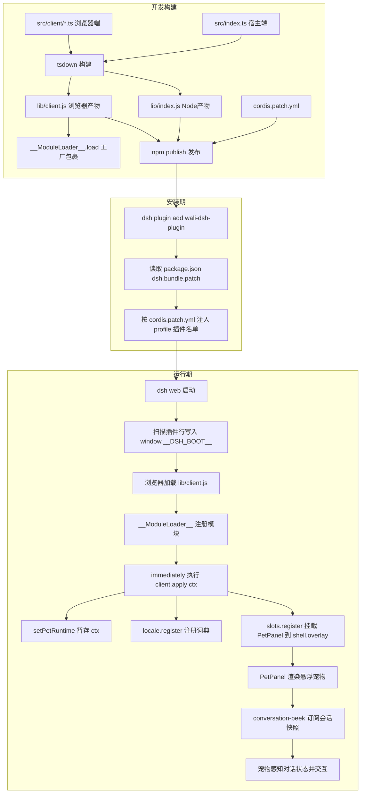

# WaLiOffice DSH 插件版本，做了2个 DSH 插件，一个企业级的，一个“死鬼”急的！

作者：小傅哥
<br/>博客：[https://bugstack.cn](https://bugstack.cn)

>沉淀、分享、成长，让自己和他人都能有所收获！😄

大家好，我是技术UP主小傅哥。

`如果你看懂了 Deepseek Harness，那么也就看懂了下一轮 AI 就业机会。` 为啥？

<div align="center">
	
</div>

其实并不是所有公司，都具备开发一套完整体  AI Agent 智能体平台的，但所有公司在 AI 时代，都有诉求，将自身业务场景与 AI 结合，进行本地化服务建设和云平台部署。

而像是 Deepseek Harness 这种东西，它不从复杂的智能体构建给你讲理论规范教程，也不设计基础的 SDK 框架。而是给你一套「一切皆插件」的自由化底座平台。短短一周时间，**183k Star**，**1.1w 插件**（大家贡献的）。

其实，你需要的，我比你还需要，还需要的更早。可能你刚有意识的事，其实我们已经在大量的铺设了。就像 Deepseek Harness Plugin 就是这一轮的风口，OpenAI 也即将跟进。

**所以，我下手啦！**

先开发了一个简单好玩的宠物插件，之后基于整个开发流程以及推送到远程 [npmjs.com](https://www.npmjs.com/) 发布版本的经验，制作了一个开发 DSH Plugin 的 Skills 技能。最后再基于技能开发了 WaLiOffice DSH Plugin 插件。

> 接下来，展示下我的 Deepseek Harness Plugin 作品，以及带着你分析这套架构和教你如何开发插件。关于这些内容，都提供了源码，可以在以下文章中获取。💐

## 一、先把环境配上

**DeepSeek Harness 一切皆插件**

>模型、工具、技能、会话、沙箱、存储、循环、调度、UI 等所有 Agent 能力均由插件组合而成，可以自由替换和灵活重组。

<div align="center">
	
</div>

- 官网：[`https://www.deepseek.com/harness/`](https://www.deepseek.com/harness/)
- 组件：[`https://www.npmjs.com/package/@deepseek-ai/dsh`](https://www.npmjs.com/package/@deepseek-ai/dsh)

```java
npm install -g @deepseek-ai/dsh
dsh web
```

建议全局安装，之后通过 `dsh web` 启动。如果你安装失败，就直接用其他 AI 工具帮你安装就可以了。

## 二、安装两个插件

### 1. 网页宠物

`wali-dsh-plugin` 是一个安装在 DSH Web 端的桌面宠物插件。安装后，页面会出现一个悬浮宠物，它会跟随会话状态变化、展示提示卡片，并支持头像、背景图、股票主题等交互。—— 可以把`心爱的人`和`赚钱的手段`展示在宠物上。

- 开源代码：[https://github.com/fuzhengwei/wali-dsh-plugin](https://github.com/fuzhengwei/wali-dsh-plugin)
- 仓库插件：[https://www.npmjs.com/package/wali-dsh-plugin](https://www.npmjs.com/package/wali-dsh-plugin)

<div align="center">
	
</div>

```java
dsh plugin --profile web add wali-dsh-plugin
dsh web
```

安装后，你可以随机领取一直宠物，还可以更换宠物形象、设置宠物背景，以及可以使用股票主题，查看你购买的股票信息。代码是开放的，如果你还有其他主题想法；`技术动态`、`播放音乐`、`刷个视频`，也都是可以在背景上搞的。这东西就是 Typescript + CSS 好搞。

### 2. 办公软件

`walioffice-dsh-plugin` 是可直接安装到 DeepSeek Harness（DSH）Web profile 的办公工具插件。插件以单个 npm 包发布，安装后一次注册 10 个办公工具，并自动注入 WaLiOffice Web 界面，以类似“豆包”、“元宝”这样的软件进行使用。

<div align="center">
	
</div>

- WaLiOffice Deepseek Harness 插件，是在 WaLiOffice [walioffice.xiaofuge.cn](https://walioffice.xiaofuge.cn/) 的软件中迭代过来的，开发成 DSH 插件版。这套东西可以让你在 Deepseek Harness 中做 Word、Excel、PPT、图表（Echart 饼图、柱状图等）、Draw.io、图片、视频。全类型办公软件。
- 嘿，`这里面隐藏一个东西，就是说你之前的各类功能，都可以嫁接在 Deepseek Harness 上。你不用操心智能体怎么开发的，你只要关心自己的功能怎么做就行。` 
- 注意，你不用操心这东西开发有多难，因为像是小傅哥这样的热衷分享的技术人很多，会做出很好用的 skills 技能。按照后，AI 工具，就可以为你开发插件了。现在搞笑又高效的就是，全世界的 AI 工具，管你 codex、claude code，都在为 Deepseek Harness 开发插件。

#### 2.1 软件安装

- 开源代码：[https://github.com/fuzhengwei/walioffice-dsh-plugin](https://github.com/fuzhengwei/walioffice-dsh-plugin)
- 仓库插件：[https://www.npmjs.com/package/walioffice-dsh-plugin](https://www.npmjs.com/package/walioffice-dsh-plugin)

```java
dsh plugin --profile web add walioffice-dsh-plugin
dsh web
```

#### 2.2 软件配置

<div align="center">
	
</div>

- 申请地址：[https://platform.agnes-ai.com/](https://platform.agnes-ai.com/) - `agnes-video-v2.0 暂时还是免费的，可以做视频。`
- API 地址：[https://apihub.agnes-ai.com/v1](https://apihub.agnes-ai.com/v1) - 如果 `.com` 、调用不了，可以换 `.cn` 
- 模型配置：`agnes-image-2.0-flash`、`agnes-image-2.1-flash`、`agnes-video-v2.0`，主要是配置图片和视频的模型。WaLiOffice 可以自己调用。

## 三、插件开发模板（Skills）

基于以上插件开发的经验，以及 Deepseek Harness 官网提供的插件开发教程，编写了插件开发模板技能。这样我们后续要开发 Deepseek Harness 插件，就不用每次都增加各类描述了。

- [https://github.com/deepseek-ai/deepseek-harness/blob/master/docs/development.zh.md](https://github.com/deepseek-ai/deepseek-harness/blob/master/docs/development.zh.md)
- [https://deepseek-harness.github.io/deepseek-harness/reference/config-catalog](https://deepseek-harness.github.io/deepseek-harness/reference/config-catalog )

<div align="center">
	
</div>

- 技能地址：[https://github.com/fuzhengwei/xfg-skills-dsp-plugin-template](https://github.com/fuzhengwei/xfg-skills-dsp-plugin-template)
- 技能安装：你可以把技能下载到本地，让 AI 工具安装到自己的技能库里就可以了。开发 Deepseek Harness 插件的时候，就告诉 AI 参考 Skills 技能进行开发。

## 四、理解插件工程（以宠物插件举例）

### 4.1 工程结构

DSH 插件是一种“双端插件（dual-face plugin）”：一个 npm 包里同时装着 **宿主端（Node 端，跑在 `dsh` 进程里）** 和 **浏览器端（Client 端，跑在网页里）** 两部分代码。

> 下文出现的“宿主半 / 浏览器半”里的“半”，就是英文 half 的直译，指插件的**这两个组成部分**——一半代码运行在 Node 宿主进程，另一半运行在浏览器页面。它们打包在同一个 npm 包里，但运行环境和职责完全不同。

目录结构如下：

```text
wali-dsh-plugin/
├── package.json          # npm 包配置 + DSH 声明（dsh.bundle / dsh.client）
├── cordis.patch.yml      # 把自己注入到 profile 的浏览器插件表
├── tsdown.config.ts      # 构建配置：产出 Node 端 + 浏览器端两个产物
├── tsconfig.json         # 仅产出类型声明（emitDeclarationOnly）
├── README.md             # 安装/更新/卸载使用说明
├── MARKET_SUBMISSION.md  # 插件市场提交清单
└── src/
    ├── index.ts                  # 宿主侧入口：apply() 空实现（纯 UI 插件）
    ├── css-modules.d.ts          # CSS Modules 类型声明
    └── client/                   # 浏览器侧实现（宠物的真正逻辑）
        ├── index.ts              # 客户端入口：inject 依赖 + 注册 slot
        ├── runtime-bridge.ts     # 把 ClientContext 暂存给 overlay 组件
        ├── conversation-peek.ts  # 订阅当前会话快照（会话感知能力）
        ├── PetPanel.tsx          # 宠物主组件（拖拽、菜单、主题、股票 K 线）
        ├── PetPanel.module.css   # 宠物样式（CSS Modules）
        ├── personas.ts           # 地域人设 / 方言语料 / 形象
        ├── festivals.ts          # 节日祝福（按日期匹配）
        └── locales.ts            # 中英文词典
```

各文件职责一句话总结：

| 文件 | 角色 | 作用 |
|------|------|------|
| `package.json` | 声明层 | 通过 `dsh.bundle.patch` 和 `dsh.client` 告诉 DSH：我是插件、我有浏览器端、我依赖哪些服务 |
| `cordis.patch.yml` | 注入层 | `dsh plugin add` 时被读取，自动把 `wali-dsh-plugin` 追加进 profile 的浏览器插件名单 |
| `src/index.ts` | 宿主端 | `apply()` 是空函数——纯 UI 插件在 Node 端没有行为，只为让插件出现在 Loader 中 |
| `src/client/index.ts` | 浏览器端入口 | 声明 `inject = ['slots','locale','sessions']`，注册词典、把宠物挂到全局悬浮层 `shell.overlay` |
| `runtime-bridge.ts` | 桥接 | overlay 组件拿不到会话作用域 props，用模块级变量把 `ctx` 递给组件 |
| `conversation-peek.ts` | 会话感知 | 通过 `ctx.sessions` 订阅当前对话快照，让宠物“看懂”AI 在干什么（运行中/工具名/token 数） |
| `PetPanel.tsx` | UI 主体 | 宠物的全部交互：自由拖拽、点击菜单、上传头像/背景、图片主题、股票 K 线主题 |

> **什么是 `ctx`（ClientContext）？** 上面表格和后文反复出现的 `ctx`，是 DSH 交给每个插件的**运行时上下文对象**，可以把它理解成整个应用的“**服务总台 / 能力仓库**”。DSH 启动时会把所有插件装配到一个统一的 `ctx` 上，插件的 `apply(ctx)` 函数被调用时就拿到这个对象，进而从上面按需取用各种能力：
>
> - `ctx.slots`：UI 插槽注册表——宠物就是通过 `ctx.slots.register` 挂到页面悬浮层的；
> - `ctx.locale`：多语言词典注册表——用 `ctx.locale.register` 注册中英文案；
> - `ctx.sessions`：会话服务——用它订阅当前对话快照，实现“会话感知”；
> - 还有 `ctx.llm`（模型）、`ctx.tools`（工具）、`ctx.agents`（子代理）等（本插件用不到）。
>
> 一句话：**插件不自己 new 服务，而是从宿主给的 `ctx` 上“领”服务**——这正是“一切皆插件、能力可组合”的技术基础。本插件因为在全局悬浮层里拿不到会话作用域的 props，才用 `runtime-bridge.ts` 把 `ctx` 暂存成模块级变量，转交给宠物组件使用。

### 4.2 关键声明：package.json 里的两个约定

插件与宿主之间靠 `package.json` 里 `dsh` 字段这份“契约”对接：

```jsonc
"dsh": {
  "bundle": {
    "patch": "./cordis.patch.yml"        // 安装时注入的 bundle 补丁路径
  },
  "client": {
    "immediately": true,                  // 页面加载后立即挂载
    "inject": [                           // 浏览器端依赖的宿主客户端能力
      "@deepseek-ai/dsh-client-runtime",
      "@deepseek-ai/dsh-client-locale",
      "@deepseek-ai/dsh-client-ui-layout"
    ],
    "platform": "web"                     // 目标平台：web
  }
}
```

同时 `exports["./client"]` 指向 `./lib/client.js`——这是宿主浏览器端加载器要抓取的浏览器产物入口。

### 4.3 构建产物：tsdown 产出两个 bundle

`tsdown.config.ts` 会同时编译出两个截然不同的产物：

1. **`lib/index.js`（Node 端）**：ESM 格式，`platform: node`，就是那个空的 `apply()`。
2. **`lib/client.js`（浏览器端）**：CJS 格式，`platform: browser`，并被一层特殊的“工厂函数”包裹：

```js
window.__ModuleLoader__.load({ id: "wali-dsh-plugin", factory: (require) => {
  var module = { exports: {} }; var exports = module.exports;
  /* ...打包后的宠物代码... */
  return module.exports;
} });
```

关键设计点：
- **平台模块外置（external）**：`react`、`@deepseek-ai/cordis`、各 `dsh-client-*` 在浏览器运行时由宿主的模块表提供，插件不重复打包，通过 `require(...)` 现取。
- **CSS Modules 内联**：`PetPanel.module.css` 经 `lightningcss` 编译为带 hash 的类名，运行时以 `<style data-plugin-css="...">` 注入 `<head>`，避免样式冲突。
- **类型声明单独产出**：`tsconfig.json` 设 `emitDeclarationOnly`，类型进 `lib/types/`。

### 4.4 加载机制：从 `dsh plugin add` 到宠物出现在页面

整个链路可以分为「安装期」与「运行期」两段。

**安装期（写配置）：**

1. 执行 `dsh plugin --profile web add wali-dsh-plugin`；`删除的话，add 换成 remove`
2. DSH 从 npm 安装该包，读取 `package.json` 的 `dsh.bundle.patch`；
3. 按 `cordis.patch.yml` 的 `insert` 指令，把一行 `{ id: ui-pet, name: 'wali-dsh-plugin' }` 追加进该 profile 的浏览器插件名单（`dsh.profile.bundles`）；
4. **无需改动宿主源码**，配置即插即用。

**运行期（装载执行）：**

1. `dsh web` 启动 Web 服务，扫描 profile 里的浏览器插件行，写入页面全局 `window.__DSH_BOOT__`；
2. 浏览器 modules 节点据此加载各插件的 `./client` 产物 `lib/client.js`；
3. 该产物调用 `window.__ModuleLoader__.load(...)` 把宠物模块注册进模块表；
4. 因 `dsh.client.immediately = true`，加载器立即执行客户端 `apply(ctx)`：
   - 用 `setPetRuntime(ctx)` 暂存上下文；
   - 通过 `ctx.locale.register` 注册中英词典；
   - 通过 `ctx.slots.register` 把 `PetPanel` 挂到全局悬浮层 `shell.overlay`（`id: pet-roamer`）；
5. `PetPanel` 挂载后，用 `conversation-peek.ts` 订阅 `ctx.sessions` 的会话快照，宠物即可“感知”对话状态并做出反应。

### 4.5 全流程图



DSH 插件 = 一个 npm 包同时装宿主端与浏览器端两部分；`package.json` 的 `dsh` 字段是契约，`cordis.patch.yml` 负责“安装时自动改配置”，`tsdown` 产出被 `__ModuleLoader__` 包裹的浏览器产物；宿主启动后经 `__DSH_BOOT__` → 模块加载 → `apply(ctx)` → `slots.register` 把 UI 挂到悬浮层。整个过程**零侵入宿主源码**，这正是“一切皆插件”的落地方式。

### 4.6 有意思的技术亮点，以及给 Java 工程师的启发

这套机制里有几个设计，单看是前端插件的小技巧，但如果你写过多年 Java / Spring，会发现它们和你熟悉的东西**惊人地对得上**。下面用“> 引用”把每个亮点和对应的 Java 概念摆在一起看：

> **亮点 1：`ctx` 依赖注入 —— 类似我们熟悉的 Spring IoC 容器**
>
> 插件从不 `new` 服务，而是接收一个 `ctx` 再从上面 `ctx.slots` / `ctx.sessions` 取用，并用 `inject = ['slots','locale','sessions']` 声明依赖。
> - **对照**：`ctx` ≈ Spring 的 `ApplicationContext`，`inject` ≈ `@Autowired` / 构造器注入，`apply(ctx)` ≈ Bean 的初始化回调（`@PostConstruct` / `InitializingBean`）。
> - **启发**：控制反转是跨语言的通用解法。DSH 把“Agent 的每种能力”都做成可注入的服务，和 Spring 把“每个业务组件”都做成 Bean 是同一种思维——**面向接口拿能力，而不是面向实现造能力**。

> **亮点 2：`cordis.patch.yml` 声明式注入 —— 等价于 Spring Boot 的 SPI 自动装配**
>
> 装插件不用改宿主任何一行源码，只往 `profile` 名单里 `insert` 一行声明，宿主启动时扫描并装配。
> - **对照**：这几乎就是 `META-INF/spring.factories` / `spring-autoconfigure-metadata` 的翻版，也神似 JDK 的 `ServiceLoader` + `META-INF/services` SPI 机制——**把“我存在、请加载我”写进约定文件，由容器发现**。
> - **启发**：好的扩展体系都遵循“**开闭原则**”：对扩展开放（丢个包+一行声明就生效），对修改关闭（宿主源码纹丝不动）。这正是 Java 生态 starter 大行其道的原因。

> **亮点 3：`shell.overlay` 插槽注册 —— 前端版的“扩展点 / SPI 接口”**
>
> 宿主预留命名插槽（`shell.overlay`），插件用 `ctx.slots.register` 往里挂 UI，还带 `order` 排序。
> - **对照**：等同于框架预留的**扩展点（Extension Point）**，如 Dubbo SPI、Servlet 的 `Filter` 链、MyBatis 的 `Interceptor` 插件——**宿主定义卡槽，第三方往卡槽里插实现**。
> - **启发**：平台化的关键不是功能多，而是**卡槽设计得好**。留对了扩展点，生态才能长出来。

> **亮点 4：会话事件源（event log）+ 快照订阅 —— CQRS / 事件溯源的实践**
>
> `conversation-peek.ts` 通过 `binding.session.subscribe` 订阅 `ConversationSnapshot`，宠物据此实时反应；DSH 内部则用 session event log 记录全过程，可回放、可恢复。
> - **对照**：这就是 **Event Sourcing + CQRS**——写入侧是不可变事件流（append-only log，类比 Kafka / EventStore），读取侧是投影出的只读快照（Read Model）。订阅快照 ≈ 观察者模式 / Spring 的 `ApplicationEvent`。
> - **启发**：Agent 系统里“过程和结果同样重要”。用事件流沉淀过程，就能像回放交易流水一样调试、审计、恢复一次 AI 任务——这对做金融、风控背景的 Java 工程师尤其亲切。

> **亮点 5：`__ModuleLoader__.load` 工厂 + 平台模块外置 —— 自定义 ClassLoader 与依赖隔离**
>
> 浏览器产物被包成 `factory: (require) => {...}`，`react`、`cordis` 等由宿主模块表提供、插件不重复打包。
> - **对照**：`__ModuleLoader__` ≈ 自定义 `ClassLoader`（如 OSGi / Tomcat 的 WebappClassLoader），`external` 依赖 ≈ Maven 的 `<scope>provided</scope>`——**公共依赖由容器提供，插件只带自己独有的部分**，避免“依赖各带一份”导致的冲突和膨胀。
> - **启发**：插件热插拔与依赖隔离，Java 世界靠 OSGi/ClassLoader 隔离解决，前端这里靠模块表+工厂函数解决，**本质都是“受控的运行时装载”**。

DSH 看着是个 TypeScript 前端框架，骨子里却也有我们在 Java 编程中的思想——**IoC 容器 + SPI 自动装配 + 扩展点插槽 + 事件溯源 + 类加载隔离**。所以后端伙伴学习，也不必被“前端插件”四个字劝退：你在 Spring / RPC / OSGi 上积累的架构直觉，几乎可以 1:1 迁移过来理解和开发 DSH 插件。

## 五、架构原理分析

当我们讨论大模型应用时，很多人首先想到的是“对话”。输入一段话，模型返回一段回答，看起来这件事已经成立了。

但如果要把它做成一个真正能工作的 Agent，问题就会立刻复杂起来：模型怎么调用工具？工具怎么受控？执行过程如何回放？失败怎么恢复？上下文如何持续？前端、CLI、API 能否共用同一套内核？

DeepSeek Harness 关注的，正是这些问题。

它不是一个单纯的聊天应用，也不是一个把工具函数简单拼起来的工作流脚本，而是一套面向 Agent 的运行时框架。如果用一句话概括，DeepSeek Harness 可以理解为：**一个基于插件机制构建的 Agent 操作系统底座。**

<div align="center">
	
</div>

这张图可以从左到右理解：最左边是用户和前端入口，中间是 Cordis 上下文与核心服务，右边是 ReAct 执行循环，下面是工具、存储和各种接入表面。

- 第一段“应用入口”讲的是启动装配：系统先读取 profile、bundle、patch 和 `cordis.yml`，再把插件挂进 `ctx`。
- 第二段“core 主干服务”讲的是五大骨架：会话、模型、工具、系统提示词、Agent 管理。
- 第三段“ReAct 循环”讲的是任务执行主线：组装请求、模型推理、工具调用、观察结果、进入下一 step 或结束 turn。
- 第四段“工具与能力 seam”讲的是能力扩展：文件系统、终端、沙箱、Web、MCP、LSP、Skill 等都通过统一管线接入。
- 第五段“持久化与表现层”讲的是系统为什么可追踪、可恢复、可投射到 CLI/Web/SDK 等多种产品形态。

**那这种东西在和 Codex、Claude Code、Workbuddy 对比的差异在哪？**

像是市面的很多这类产品，都是完整智能体，最直接的一个体现是。Deepseek Harness 默认情况下对话也就几k，而 Codex 要到 20k 以上，如果解决某个场景问题，基本 Codex 要平均跑到 60k-80k 每次对话。

<div align="center">
	
</div>

通过这样一个数据对比，我们可以知道，Deepseek Harness 本就是属于一个 Agent 操作系统底座。它不像其他 Agent 工具，把提示词写的很多（含带各类工具），而是最基本运行的提示词。之后，你想结合具体场景开发什么，就只解决当前场景即可，不会导致上下文爆发。这就很适合公司里做自己的具体业务场景。

>将来，会有很多 Xxx Harness 工程，不只是一个框架的，也不只是一个语言的结构的。这个东西，去年这个时候，我给一个正在做智能体的“老板”讲过我的思考；基建底座 + 插件平台。这样可以解决各类场景智能体服务，不至于把所有东西都填充到一个智能体里了。

### 1. 运行机制

理解 DeepSeek Harness，最好的方式不是先看某个具体包，而是先看它的整体工作方式。

可以把它理解成四层。

#### 1.1 装配层：先搭世界，再跑 Agent

DeepSeek Harness 启动时，不是直接 new 一个应用实例，而是先读取配置，再把插件装配成运行时上下文。

这一层通常涉及几个关键概念：

- `profile`：一种运行形态的组合定义
- `bundle`：一组默认能力的打包集合
- `patch`：对默认配置的覆盖和增量修改
- `cordis.yml`：插件树与配置的声明式入口

系统启动后，会把这些配置按顺序合并，最终构建出一个统一的 `ctx`。
这个 `ctx` 可以理解成整个运行时的“服务仓库”，里面挂载了模型、会话、工具、Prompt、Agent、沙箱、Web、子代理等各种能力。

所以，DeepSeek Harness 的第一步不是“发请求给模型”，而是**先把一个可运行的 Agent 世界装起来。**

#### 1.2 核心服务层：五大主干能力

装配完成后，系统内部最核心的骨架主要由几类服务组成：

- `sessions`：管理会话事件与内存状态
- `llm`：负责模型请求与流式输出
- `tools`：管理工具注册、调度与执行
- `systemPrompt`：负责系统提示词与工具 schema 组装
- `agents`：管理 Agent 的创建、生命周期与调度

这几块不是普通业务模块，而是稳定的系统能力接口。你可以把它们理解成 Agent 内核中的“五大基础设施”。

其中最重要的一点是：这些能力彼此协作，但不是硬编码耦合在一起。
它们通过统一的上下文和事件机制协同，因此每块都可以扩展、替换，甚至在某些场景下被重新组合。

#### 1.3 执行循环层：让 Agent 真正“边想边做”

如果说上面两层解决的是“系统怎么搭起来”，那么执行循环层解决的就是“Agent 怎么工作起来”。DeepSeek Harness 的执行核心是一个典型的 ReAct 循环，也就是：

- 推理
- 行动
- 观察
- 再推理

它不是一次请求一次回答，而是把一次任务拆成多个 `step`，再把多个 `step` 组织成一个 `turn`。可以把它理解为：

- `turn`：一次完整任务推进
- `step`：一次模型请求及其引发的工具调用过程

每个 step 大致会经历下面几个阶段：

1. 认领当前输入，打开 turn  （运转）
2. 组装 prompt、可见工具和历史消息  
3. 把请求发送给模型  
4. 模型流式返回文本、推理内容或工具调用意图  
5. 工具系统执行调用  
6. 工具结果写回会话历史  
7. 模型根据 observation（观察） 再决定是否继续下一 step  
8. 如果本轮不再产生 tool call，则结束 turn

这就是 DeepSeek Harness 和普通聊天程序最大的区别。它不是“问一次，答一次”，而是**通过多步循环，把模型变成一个会持续决策和执行的 Agent。**

#### 1.4 能力扩展层：把外部世界接进来

只有模型循环还不够，Agent 真正有价值，必须能操作外部能力。DeepSeek Harness 把这些能力做成统一的工具接缝，包括：

- 文件系统
- Shell 与终端
- 沙箱与代码运行环境
- 子进程能力
- Web 搜索与抓取
- LSP（Language Server Protocol）语言服务协议
- MCP 模型上下文协议
- Skills
- Todo / Plan / Goal - 任务/计划/目标
- 子代理与后台任务

这些能力并不是零散接入的，而是通过统一的工具管线调度。也就是说，模型不会直接碰到底层实现，而是通过标准化工具定义发起调用，由运行时负责鉴权、拦截、执行、收尾和结果回传。这让系统具备两个优势：

- 对模型而言，能力暴露是一致的
- 对平台而言，执行治理是统一的

### 2. 核心设计

如果一定要提炼 DeepSeek Harness 的架构精髓，我会总结成三点。

#### 2.1 插件化：一切能力都能组合与替换

DeepSeek Harness 并不是围绕某一个固定实现搭建的。它从一开始就把“能力”设计成插件，把“系统”设计成组合。

这意味着：

- 模型适配器可以换
- 工具提供方可以换
- Web 和 CLI 只是不同表面
- 持久化方式可以演进
- 某个功能可以作为插件装上，也可以拆下

这种方式特别适合 Agent 系统，因为 Agent 天然是一个多能力协作系统，变化会非常频繁。如果没有插件化，后期几乎一定会陷入高耦合和难扩展。

#### 2.2 事件源：系统不是只要结果，还要完整过程

DeepSeek Harness 很强调 session event log。这是因为在 Agent 系统里，“过程”与“结果”同样重要。就是我们看到的轨迹日志。

用户输入了什么、模型什么时候发起请求、工具调用了什么、返回了什么、turn（运转） 为什么结束、step 为什么继续，这些都应该是可记录、可回放、可查询的。

事件源设计带来的价值非常大：

- 可以恢复执行
- 可以调试行为
- 可以审计过程
- 可以把模型可见事实与系统真实状态对齐

这对于复杂 Agent 来说，不是锦上添花，而是基础设施。

#### 2.3 ReAct 循环：让模型从回答者变成执行者

很多系统只是把模型当“文本生成器”。
而 DeepSeek Harness 则把模型放进一个完整循环里，让它在系统中持续做三件事：

- 看见环境
- 做出决策
- 触发行动

工具结果回来后，模型还能继续理解和推进任务。
因此它不再只是一个被动回答问题的接口，而更像一个能够驱动任务的执行者。

这也是 DeepSeek Harness 最像 Agent 平台，而不是普通聊天应用的地方。

>DeepSeek Harness 的核心优势，不在于做出一个 AI 产品，而在于沉淀出一套可以反复复用的智能体基础设施。

DeepSeek Harness 的优势，不在于它只能做一个 AI 编码工具，而在于它提供了一套可复用的智能体运行基座。基于这套基座，既可以做 Web 服务，去承载智能客服、数据分析、运维助手等业务场景；也可以做成本地开发工具软件，服务研发与工程自动化；进一步还可以延展到移动端，成为类似豆包那样的智能体入口。  

更重要的是，公司需要的往往不是一个单点产品，而是一套能够支撑多场景演进的基础设施。一个 `XxxCode` 即使不断叠加 skills，也很难解决状态管理、工具治理、权限控制、执行闭环、跨端复用这些系统性问题。真正要支撑各类智能体服务，必须建设 Harness 这样的底座。  

从这个角度看，DeepSeek Harness 不是终点，而是起点。未来不会只有一个 DeepSeek Harness，还会有更多面向不同语言、不同运行环境、不同业务场景的 Harness，共同构成公司的智能体基础设施体系。

更重要的是，公司需要的往往不是一个单点产品，而是一套能够支撑多场景演进的基础设施。一个 `XxxCode` 即使不断叠加 skills，也很难解决状态管理、工具治理、权限控制、执行闭环、跨端复用这些系统性问题。真正要支撑各类智能体服务，必须建设 Harness 这样的底座。  

从这个角度看，DeepSeek Harness 不是终点，而是起点。未来不会只有一个 DeepSeek Harness，还会有更多面向不同语言、不同运行环境、不同业务场景的 Harness，共同构成公司的智能体基础设施体系。
